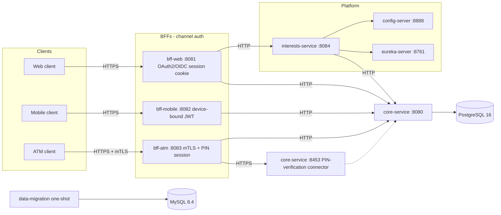

# XYZ Bank Server

Plataforma BFF de XYZ Bank: tres backends por canal (`bff-web`, `bff-mobile`, `bff-atm`) frente a un `core-service` interno y un `interests-service` extraído (con `config-server` y `eureka-server`), más un job de migración CSV hacia MySQL.

**Autenticación y HTTPS están implementadas con configuración de desarrollo.** Cada canal se autentica con una credencial real — cookie de sesión (web), JWT de dispositivo (mobile), o certificado mTLS del terminal más un PIN de tarjeta (ATM) — pero todo el material de confianza es de dev/test: un proveedor OIDC simulado (mock, ver `platform/*/src/test/.../MockOidcProvider`), un secreto de firma de sesión fijo, credenciales de servicio por BFF fijas, y una CA de desarrollo autofirmada (`scripts/generate-dev-tls-certs.sh`). Antes de un despliegue real hace falta: un IdP externo real, una CA gestionada que emita certificados reales, y credenciales de servicio rotadas por BFF.

El login de `bff-web`/`bff-mobile` pasa por ese proveedor OIDC simulado, que solo existe como fixture de test (WireMock, arrancado por los propios tests) — no corre como servicio dentro de `docker compose up`. Por eso los ejemplos de `curl` de este README no incluyen el login completo de web/mobile: se pueden ejercitar levantando ese fixture vía los tests (`mvn test` en `bff-web`/`bff-mobile`), o conectando un proveedor OIDC real. El flujo de ATM (verificación de PIN) no depende de ningún proveedor externo y sí es 100% ejecutable contra el stack de `docker compose`, como se muestra más abajo.

## Prerrequisitos

- Java 21
- Docker Desktop (o un daemon Docker compatible) con Compose v2
- Maven 3.9+ (o el wrapper del módulo de migración si se usa de forma aislada)

## Topología del proyecto

Cada canal prueba la identidad del llamante con una credencial real en vez de una cabecera de confianza: cookie de sesión OAuth2/OIDC para web, JWT de dispositivo para mobile, y mTLS más una sesión verificada por PIN para ATM. Todo borde de cara al cliente es TLS; el borde BFF→`core-service` sigue siendo HTTP plano salvo la única llamada que transporta un PIN, que es TLS-only por diseño. `bff-web` enruta el resumen de intereses a `interests-service` cuando `FEATURE_USE_INTERESTS_SERVICE=true`; `interests-service` reenvía a `core-service` con el Bearer del llamante y `X-Service-Credential`.



`CoreServicePin` es un segundo conector Tomcat del mismo `core-service`, no un servicio aparte — comparte proceso y acceso a base de datos; se dibuja por separado solo para mostrar que ese conector exige TLS mientras el resto de `core-service` sigue en HTTP plano. `interests-service` es un deployable aparte: toma configuración de `config-server` (repo nativo `config-repo/`) y se registra en `eureka-server`. `bff-web` lo llama por URL estática (`INTERESTS_SERVICE_BASE_URL`), no por discovery. Detalle completo de cada credencial por canal en `docs/contracts/*/openapi.yaml` y en `docs/architecture.md`.

## Arranque local

Desde la raíz del repositorio:

```bash
docker compose up --build
```

Eso levanta:

| Servicio | Puerto | Rol |
|---|---|---|
| MySQL 8.4 | 3306 | Reportes de la migración CSV |
| PostgreSQL 16 | 5432 | Datos de `core-service` |
| data-migration | (one-shot) | Procesa los CSV y sale con código 0 |
| config-server | 8888 | Configuración nativa (`config-repo/`) |
| eureka-server | 8761 | Service discovery |
| core-service | 8080 | API interna de dominio |
| interests-service | 8084 | Resumen anual de intereses |
| bff-web | 8081 | Dashboard, historial e intereses |
| bff-mobile | 8082 | Resumen aplanado de cuenta |
| bff-atm | 8083 | Saldo y retiro |

El job espera a que MySQL esté sano. `core-service` espera a PostgreSQL **y** a que la migración termine con éxito. `eureka-server` espera a `config-server`. `interests-service` espera a `config-server`, `eureka-server` y `core-service`. Los BFFs esperan a que `core-service` reporte `/actuator/health` en UP; `bff-web` además espera a `interests-service`.

Enrutamiento de intereses en `bff-web`:

| Variable | Default en Compose | Efecto |
|---|---|---|
| `FEATURE_USE_INTERESTS_SERVICE` | `true` | `true`: `bff-web` llama a `interests-service`. `false`: llama a `core-service` en `/internal/accounts/{id}/interest-summary`. |
| `INTERESTS_SERVICE_BASE_URL` | `http://interests-service:8084` | Base URL de `interests-service`. |

Para forzar el path legacy: `FEATURE_USE_INTERESTS_SERVICE=false docker compose up -d bff-web`.

Para apagar: `docker compose down`. Para resetear volúmenes (incluido el seed de demo): `docker compose down -v`.

## Datos de demo

Tras un arranque limpio, PostgreSQL contiene un cliente y una cuenta fijos (Flyway `V6__seed_demo_data.sql`). No se copian filas desde MySQL.

| Recurso | UUID |
|---|---|
| Cliente | `11111111-1111-1111-1111-111111111111` |
| Cuenta | `22222222-2222-2222-2222-222222222222` |
| Número de cuenta | `1000000001` |
| Resumen de intereses | año `2025` |

## Verificar la migración (MySQL)

```bash
docker compose exec mysql mysql -umigration -pmigration xyz_bank_migration -e "SELECT * FROM migration_executions;"
docker compose exec mysql mysql -umigration -pmigration xyz_bank_migration -e "SELECT COUNT(*) FROM daily_transaction_reports;"
docker compose exec mysql mysql -umigration -pmigration xyz_bank_migration -e "SELECT COUNT(*) FROM account_balances;"
docker compose exec mysql mysql -umigration -pmigration xyz_bank_migration -e "SELECT COUNT(*) FROM annual_audit_reports;"
```

`status = SUCCESS` en `migration_executions` para `dailyTransactionsJob`, `monthlyInterestsJob` y `annualGenerationJob` indica que el job ya corrió. Un segundo `docker compose up` reutiliza el volumen y el job vuelve a salir 0 (ya migrado).

## Certificados TLS de desarrollo

Los tres BFFs sirven HTTPS con certificados de una CA de desarrollo autofirmada; `bff-atm` además exige un certificado de cliente (mTLS) del terminal. `core-service` es plano HTTP salvo su conector de verificación de PIN (puerto 8453), que es TLS-only por diseño — ver `docs/contracts/core-service/openapi.yaml`.

Generar (o regenerar) la CA y todos los certificados:

```bash
./scripts/generate-dev-tls-certs.sh
```

Esto escribe `dev/certs/` (montado por `docker-compose.yml`) y una copia bajo `src/test/resources/tls/` en cada módulo que la necesita. Es dev-only: nunca reutilices esta CA en un entorno real.

Para que `curl` acepte la cadena autofirmada sin desactivar la validación, pásale la CA con `--cacert dev/certs/ca.crt` (todos los ejemplos de abajo lo hacen); alternativamente, `-k` la ignora por completo. Para confiar en la CA a nivel de sistema/navegador (útil para abrir `bff-web` en un navegador):

```bash
# macOS
security add-trusted-cert -d -r trustRoot -k ~/Library/Keychains/login.keychain-db dev/certs/ca.crt

# Linux (Debian/Ubuntu)
sudo cp dev/certs/ca.crt /usr/local/share/ca-certificates/xyz-bank-dev-ca.crt && sudo update-ca-certificates
```

## Ejemplos de curl

Sustituye nada: estos IDs coinciden con el seed. El login OIDC de `bff-web`/`bff-mobile` no es ejercitable contra este stack (ver nota arriba); el flujo completo de ATM sí lo es.

**bff-atm — verificar PIN, consultar saldo y retirar**

La tarjeta demo (PIN `1234`) pertenece al cliente/cuenta del seed. Cada request debe presentar el certificado de cliente del terminal (mTLS):

```bash
TERMINAL_CERT="dev/certs/atm-terminal/keystore.p12:xyzbank-dev"

# 1. Verificar PIN -> obtiene una sesión de 120 segundos
SESSION_TOKEN=$(curl -sS --cacert dev/certs/ca.crt \
  --cert-type P12 --cert "$TERMINAL_CERT" \
  -X POST https://localhost:8083/pin-verifications \
  -H "Content-Type: application/json" \
  -d '{"cardNumber":"77777777-7777-7777-7777-777777777777","pin":"1234"}' \
  | jq -r .sessionToken)

# 2. Consultar saldo
curl -sS --cacert dev/certs/ca.crt \
  --cert-type P12 --cert "$TERMINAL_CERT" \
  https://localhost:8083/accounts/22222222-2222-2222-2222-222222222222/balance \
  -H "Authorization: Bearer $SESSION_TOKEN"

# 3. Retirar (Idempotency-Key evita un doble retiro si se reintenta la misma llamada)
curl -sS --cacert dev/certs/ca.crt \
  --cert-type P12 --cert "$TERMINAL_CERT" \
  -X POST https://localhost:8083/accounts/22222222-2222-2222-2222-222222222222/withdrawals \
  -H "Content-Type: application/json" \
  -H "Authorization: Bearer $SESSION_TOKEN" \
  -H "Idempotency-Key: demo-withdrawal-1" \
  -d '{"amount":40.00,"currency":"USD"}'
```

La sesión expira a los 120 segundos: repite el paso 1 si el paso 2 o 3 devuelven 422. Tres PINs incorrectos seguidos bloquean la tarjeta demo (423 en adelante, incluso con el PIN correcto); desbloquéala con `./scripts/reset-dev-card-lock.sh` (requiere el stack de `docker compose` arriba).

**bff-web / bff-mobile — una vez autenticado**

El login real requiere un proveedor OIDC (ver la nota al inicio de este README). Una vez completado, `bff-web` guarda la sesión en una cookie httpOnly (`session`) que el navegador reenvía solo; `bff-mobile` devuelve `sessionToken`/`refreshToken` en el cuerpo de la respuesta de login, que el cliente nativo debe reenviar como `Authorization: Bearer` junto con `X-Device-Id`. Con esos ya obtenidos, las llamadas de dominio lucen así:

```bash
# bff-web (cookie de sesión ya presente)
curl -sS --cacert dev/certs/ca.crt \
  -b "session=$SESSION_COOKIE" \
  https://localhost:8081/customers/11111111-1111-1111-1111-111111111111/dashboard

curl -sS --cacert dev/certs/ca.crt \
  -b "session=$SESSION_COOKIE" \
  "https://localhost:8081/accounts/22222222-2222-2222-2222-222222222222/interest-summary?year=2025"

# bff-mobile (JWT de dispositivo)
curl -sS --cacert dev/certs/ca.crt \
  -H "Authorization: Bearer $DEVICE_TOKEN" \
  -H "X-Device-Id: $DEVICE_ID" \
  https://localhost:8082/accounts/22222222-2222-2222-2222-222222222222/summary
```

Health y OpenAPI:

```bash
curl -sS http://localhost:8080/actuator/health
curl -sS http://localhost:8084/actuator/health
curl -sS http://localhost:8888/actuator/health
curl -sS http://localhost:8761/actuator/health
curl -sS --cacert dev/certs/ca.crt https://localhost:8081/v3/api-docs
```

Contratos en el repo: [`docs/contracts/`](docs/contracts/). Arquitectura: [`docs/architecture.md`](docs/architecture.md). ADR de BFFs: [`docs/adr/001-bff-strategy.md`](docs/adr/001-bff-strategy.md).

## Tests

```bash
# Unitarios y E2E que no requieren failsafe (incluye Testcontainers saltados si no hay Docker)
mvn test

# Incluye tests de integración (`*IT`)
mvn verify
```

Los ITs de PostgreSQL/MySQL usan Testcontainers. Sin Docker se omiten (`disabledWithoutDocker`) en lugar de fallar.

## Troubleshooting

- **Puertos 3306 o 5432 ocupados.** Otro MySQL/Postgres local está usando el puerto. Para este stack esos puertos deben estar libres, o para el stack con `docker compose down` (eso no apaga bases de otros proyectos).
- **Puertos 8084, 8888 o 8761 ocupados.** Otro proceso está usando el puerto de `interests-service`, `config-server` o `eureka-server`. Libéralos o baja el stack con `docker compose down`.
- **El seed de demo desapareció o el dashboard da 404.** Flyway no reinserta filas de una versión ya aplicada. Reset: `docker compose down -v` y vuelve a `up --build`.
- **La migración falló y core-service no arranca.** Compose espera `service_completed_successfully`. Revisa `docker compose logs data-migration`.
- **PostgreSQL cae con el stack ya arriba.** `GET http://localhost:8080/actuator/health` deja de reportar UP (Actuator incluye el datasource). Los BFFs no tienen base propia: su health sigue UP aunque Postgres esté caído.
- **Testcontainers skipped.** Arranca Docker Desktop y vuelve a `mvn verify`.
- **Solo quieres experimentar el job CSV.** Sigue usando [`data-migration/docker-compose.yml`](data-migration/docker-compose.yml) (MySQL aislado). El camino soportado de plataforma completa es el Compose de la raíz.
- **`curl` falla el handshake TLS contra `bff-atm` con un certificado de cliente (`error:...SSL routines:ST_CONNECT:tlsv1 alert protocol version` o similar).** El `curl`/LibreSSL que trae macOS de fábrica tiene problemas negociando TLS con certificados de cliente P12 contra este stack. Instala una build de `curl` enlazada con OpenSSL (p. ej. `brew install curl`) o usa `openssl s_client` para depurar la conexión.
