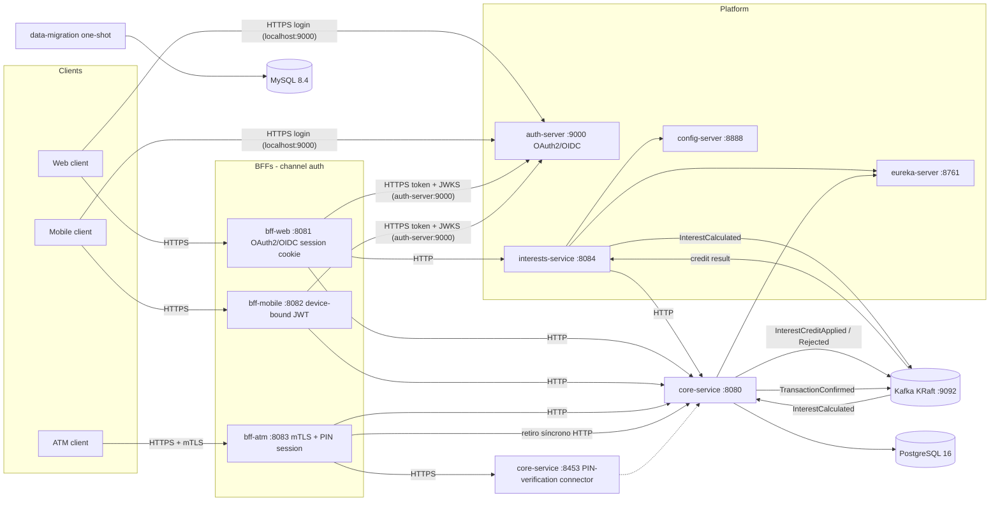

# XYZ Bank Server

Plataforma BFF de XYZ Bank: tres backends por canal (`bff-web`, `bff-mobile`, `bff-atm`) frente a un `core-service` interno y un `interests-service` extraído (con `config-server` y `eureka-server`), más un job de migración CSV hacia MySQL.

**Autenticación y HTTPS están implementadas con configuración de desarrollo.** Cada canal se autentica con una credencial real — cookie de sesión (web), JWT de dispositivo (mobile), o certificado mTLS del terminal más un PIN de tarjeta (ATM) — pero todo el material de confianza es de dev/test: un usuario demo con contraseña fija, un secreto de cliente fijo para `bff-web`, un secreto de firma de sesión fijo, credenciales de servicio por BFF fijas, y una CA de desarrollo autofirmada con sus certificados y la clave de firma de tokens de `auth-server`. Estas últimas no están en el repositorio: cada desarrollador las genera en su máquina con `scripts/generate-dev-tls-certs.sh` (ver [Arranque local](#arranque-local)). Antes de un despliegue real hace falta: usuarios reales en el servidor de autorización, secretos y claves de firma provistos fuera del repo, una CA gestionada que emita certificados reales, y credenciales de servicio rotadas por BFF.

El login de `bff-web`/`bff-mobile` pasa por `auth-server` (Spring Authorization Server, `platform/auth-server`), que corre dentro de `docker compose up` en `https://localhost:9000`. Los tres flujos (web, mobile y ATM) son ejecutables de punta a punta contra el stack, como se muestra más abajo. Los tests de `bff-web`/`bff-mobile` siguen usando su proveedor OIDC simulado (`MockOidcProvider`, WireMock), sin depender de `auth-server`.

## Prerrequisitos

- Java 21
- Docker Desktop (o un daemon Docker compatible) con Compose v2
- Maven 3.9+ (o el wrapper del módulo de migración si se usa de forma aislada)

## Topología del proyecto

Cada canal prueba la identidad del llamante con una credencial real en vez de una cabecera de confianza: cookie de sesión OAuth2/OIDC para web, JWT de dispositivo para mobile, y mTLS más una sesión verificada por PIN para ATM. Todo borde de cara al cliente es TLS; el borde BFF→plataforma sigue siendo HTTP plano salvo la única llamada que transporta un PIN, que es TLS-only por diseño. `bff-web` enruta el resumen de intereses a `interests-service` (flag `FEATURE_USE_INTERESTS_SERVICE`, default `true`). El GET de resumen sigue siendo síncrono: `interests-service` reenvía el Bearer del usuario a `core-service`. La acreditación anual, con `FEATURE_INTEREST_CREDIT_VIA_KAFKA` en `false` (default), sigue siendo el POST HTTP con scope `interests:write`. Con la flag en `true`, `interests-service` publica `InterestCalculated` y `core-service` responde por `interests.credit-results` (saga coreografiada; ver [`docs/adr/002-event-architecture.md`](docs/adr/002-event-architecture.md)).


```mermaid
flowchart LR
  subgraph clients [Clients]
    WebClient[Web client]
    MobileClient[Mobile client]
    AtmClient[ATM client]
  end

  subgraph bffs [BFFs - channel auth]
    BffWeb[bff-web :8081 OAuth2/OIDC session cookie]
    BffMobile[bff-mobile :8082 device-bound JWT]
    BffAtm[bff-atm :8083 mTLS + PIN session]
  end

  subgraph platform [Platform]
    AuthServer[auth-server :9000 OAuth2/OIDC]
    ConfigServer[config-server :8888]
    EurekaServer[eureka-server :8761]
    InterestsService[interests-service :8084]
  end

  CoreService[core-service :8080]
  CoreServicePin[core-service :8453 PIN-verification connector]
  Kafka[(Kafka KRaft :9092)]
  Postgres[(PostgreSQL 16)]
  MySQL[(MySQL 8.4)]
  Migration[data-migration one-shot]

  WebClient -- HTTPS --> BffWeb
  MobileClient -- HTTPS --> BffMobile
  WebClient -- "HTTPS login (localhost:9000)" --> AuthServer
  MobileClient -- "HTTPS login (localhost:9000)" --> AuthServer
  BffWeb -- "HTTPS token + JWKS (auth-server:9000)" --> AuthServer
  BffMobile -- "HTTPS token + JWKS (auth-server:9000)" --> AuthServer
  AtmClient -- HTTPS + mTLS --> BffAtm
  BffWeb -- HTTP --> InterestsService
  BffWeb -- HTTP --> CoreService
  BffMobile -- HTTP --> CoreService
  BffAtm -- HTTP --> CoreService
  BffAtm -- HTTPS --> CoreServicePin
  InterestsService -- HTTP --> CoreService
  InterestsService -- "InterestCalculated" --> Kafka
  Kafka -- "InterestCalculated" --> CoreService
  CoreService -- "InterestCreditApplied / Rejected" --> Kafka
  Kafka -- "credit result" --> InterestsService
  CoreService -- "TransactionConfirmed" --> Kafka
  BffAtm -- "retiro síncrono HTTP" --> CoreService
  InterestsService --> ConfigServer
  InterestsService --> EurekaServer
  CoreService --> EurekaServer
  CoreService --> Postgres
  CoreServicePin -.-> CoreService
  Migration --> MySQL
```

`CoreServicePin` es un segundo conector Tomcat del mismo `core-service`, no un servicio aparte — comparte proceso y acceso a base de datos; se dibuja por separado solo para mostrar que ese conector exige TLS mientras el resto de `core-service` sigue en HTTP plano. `interests-service` toma configuración de `config-server` (repo nativo `config-repo/`), se registra en Eureka, descubre `core-service` por nombre de servicio (LoadBalancer), y aplica tolerancia a fallos con Resilience4j (circuit breaker) hacia core en las llamadas HTTP (resumen, saldo y, con la flag de Kafka apagada, el crédito). Kafka es un broker único en KRaft, sin ZooKeeper. Los tópicos `interests.calculated`, `interests.credit-results` y `transactions.confirmed` los crea `kafka-init` al arrancar. Cada movimiento de dinero confirmado en `core-service` (retiro ATM síncrono o crédito de interés) publica `TransactionConfirmed` vía outbox a `transactions.confirmed` (clave `accountId`). La flecha HTTP de intereses a core sigue siendo el camino del GET y del crédito síncrono. Detalle completo de cada credencial por canal en `docs/contracts/*/openapi.yaml` y en `docs/architecture.md`.

## Arranque local

Desde la raíz del repositorio:

```bash
# 1. Solo la primera vez en cada máquina: genera la CA de desarrollo, los certificados TLS
#    y la clave de firma de tokens en dev/certs/ (no versionado, ver más abajo)
./scripts/generate-dev-tls-certs.sh

# 2. Levanta el stack
docker compose up --build
```

`docker-compose.yml` monta los keystores de `dev/certs/` en los contenedores. Si te saltas el paso 1, los servicios con TLS (`auth-server`, los BFFs y `core-service`) no arrancan; ver [Troubleshooting](#troubleshooting). El paso 1 requiere `keytool`, que viene con el JDK 21 de los prerrequisitos.

Eso levanta:

| Servicio | Puerto | Rol |
|---|---|---|
| MySQL 8.4 | 3306 | Reportes de la migración CSV |
| PostgreSQL 16 | 5432 | Datos de `core-service` |
| PostgreSQL 16 (`auth-postgres`) | (interno) | Estado de `auth-server`: autorizaciones y clientes registrados. Sin puerto publicado |
| data-migration | (one-shot) | Procesa los CSV y sale con código 0 |
| config-server | 8888 | Configuración nativa (`config-repo/`) |
| eureka-server | 8761 | Service discovery |
| Kafka (KRaft) | 9092 | Broker de la saga de intereses |
| core-service | 8080 | API interna de dominio |
| interests-service | 8084 | Cálculo/acreditación de intereses anuales |
| bff-web | 8081 | Dashboard, historial e intereses |
| bff-mobile | 8082 | Resumen aplanado de cuenta |
| bff-atm | 8083 | Saldo y retiro |
| auth-server | 9000 | Servidor OAuth 2.0 / OIDC (login web y mobile), solo HTTPS |

El job espera a que MySQL esté sano. `kafka-init` espera a que el broker esté sano y crea los tres tópicos. `core-service` espera a PostgreSQL, a que la migración termine con éxito, a Eureka y a `kafka-init`. `eureka-server` espera a `config-server`. `interests-service` espera a `config-server`, `eureka-server`, `core-service` y `kafka-init`. Los BFFs esperan a que `core-service` reporte `/actuator/health` en UP; `bff-web` además espera a `interests-service`, y `bff-web`, `bff-mobile`, `bff-atm` e `interests-service` esperan a que `auth-server` esté sano.

### Servidor de autorización (`auth-server`)

`auth-server` es el único emisor de tokens. Cuatro clientes confidenciales: `bff-web` y `bff-mobile` (`authorization_code` + PKCE obligatorio y `refresh_token`), `bff-atm` e `interests-service` (`client_credentials` solamente). Los clientes de canal solo pueden pedir `openid`, `profile` y los scopes de su canal (`Channel.java`); si piden un scope de otro canal, la solicitud entera se rechaza con `invalid_scope`. Los tokens de usuario llevan `sub` = id del cliente del banco y el claim `channel` (`WEB` | `MOBILE`). Los de servicio llevan `channel` `ATM` o `INTERESTS` y no identifican a un cliente. Todos se firman RS256 con la clave de `dev/certs/auth-server/signing.p12`; la clave pública se publica en `https://localhost:9000/oauth2/jwks`. Si falta el keystore de firma, `auth-server` no arranca: nunca genera una clave en memoria, así que reiniciarlo no invalida los tokens emitidos. Ningún servicio comparte un secreto de firma con otro. La sesión de cajero (HS256, 120 s) la firma solo `bff-atm` con `BFF_ATM_SESSION_SECRET`.

El estado de `auth-server` (autorizaciones, consentimientos, clientes registrados, rotación de refresh tokens y dispositivos móviles) vive en su propia base PostgreSQL, `auth-postgres`: contenedor, base (`auth_server`), usuario y volumen propios, separados de `core_service`. Sobrevive a reinicios de `auth-server` (un código emitido antes de reiniciar sigue canjeable, y uno ya usado sigue rechazado). Flyway crea el esquema al arrancar y los cuatro clientes se registran en cada arranque, con el secreto guardado solo como hash bcrypt. Para inspeccionarla:

```bash
docker compose exec auth-postgres psql -U auth_server -d auth_server -c 'select client_id from oauth2_registered_client'
```

El issuer es siempre `https://localhost:9000`. El navegador llega a `auth-server` por `localhost`, pero los contenedores de los BFFs lo alcanzan por la red de Docker como `auth-server`: por eso cada BFF recibe una `authorization-uri` pública (`https://localhost:9000/oauth2/authorize`) y `token-uri`/`jwk-set-uri` internas (`https://auth-server:9000/...`), y valida el `iss` del ID token contra `OIDC_ISSUER`. Si cambias el puerto publicado, cambia `AUTH_ISSUER` y las variables `OIDC_*` juntas. Detalle en [`docs/architecture.md`](docs/architecture.md).

| Variable | Default en Compose | Uso |
|---|---|---|
| `AUTH_DEMO_PASSWORD` | `demo-password` | Contraseña del usuario demo `demo` |
| `BFF_WEB_CLIENT_SECRET` | `bff-web-dev-secret` | Secreto de `bff-web` (`auth-server` y `bff-web`) |
| `BFF_MOBILE_CLIENT_SECRET` | `bff-mobile-dev-secret` | Secreto de `bff-mobile` (`auth-server` y `bff-mobile`) |
| `BFF_ATM_CLIENT_SECRET` | `bff-atm-dev-secret` | Secreto de `bff-atm` (`auth-server` y `bff-atm`) |
| `BFF_ATM_SESSION_SECRET` | `dev-channel-auth-jwt-signing-secret-please-rotate-in-prod` | Firma HS256 de la sesión de terminal; solo `bff-atm` |
| `INTERESTS_SERVICE_CLIENT_SECRET` | `interests-service-dev-secret` | Secreto de `interests-service` (`auth-server` e `interests-service`) |
| `AUTH_DB_USERNAME` / `AUTH_DB_PASSWORD` | `auth_server` / `auth_server` | Credenciales de `auth-postgres`, que solo usa `auth-server` |

`auth-server` y los certificados/llaves de desarrollo: `./scripts/generate-dev-auth-server-keys.sh` reemite el certificado TLS de `auth-server` (válido para `localhost` y `auth-server`) y su keystore de firma usando la CA existente, sin regenerarla.

Enrutamiento de intereses en `bff-web`:

| Variable | Default en Compose | Efecto |
|---|---|---|
| `FEATURE_USE_INTERESTS_SERVICE` | `true` | `true`: `bff-web` llama a `interests-service`. `false`: llama a `core-service` en `/internal/accounts/{id}/interest-summary`. |
| `INTERESTS_SERVICE_BASE_URL` | `http://interests-service:8084` | Base URL de `interests-service`. |
| `FEATURE_INTEREST_CREDIT_VIA_KAFKA` | `false` | `false`: `interests-service` acredita por HTTP. `true`: publica `InterestCalculated` en `interests.calculated` y no llama a `creditInterest`. El GET de resumen no cambia. |
| `FEATURE_TRANSACTION_CONFIRMED_EVENTS` | `true` (Compose) / `false` (app default) | `true`: `core-service` escribe `TransactionConfirmed` en el outbox y el relay lo publica en `transactions.confirmed`. Independiente de la saga de intereses. |

Para forzar el path legacy del resumen: `FEATURE_USE_INTERESTS_SERVICE=false docker compose up -d bff-web`.

Para acreditar por la saga: `FEATURE_INTEREST_CREDIT_VIA_KAFKA=true docker compose up -d core-service interests-service`. Eso enciende el listener, el outbox y el relay de `core-service` y el productor/consumidor de `interests-service`. Con la flag en `false` el crédito HTTP no escribe outbox de intereses; `FEATURE_TRANSACTION_CONFIRMED_EVENTS` sigue pudiendo publicar movimientos confirmados.

Para apagar: `docker compose down`. Para resetear volúmenes (incluido el seed de demo): `docker compose down -v`.

## Datos de demo

Tras un arranque limpio, PostgreSQL contiene un cliente y una cuenta fijos (Flyway `V6__seed_demo_data.sql`). No se copian filas desde MySQL.

| Recurso | UUID |
|---|---|
| Cliente | `11111111-1111-1111-1111-111111111111` |
| Cuenta | `22222222-2222-2222-2222-222222222222` |
| Número de cuenta | `1000000001` |
| Resumen de intereses | año `2025` |
| Login (`auth-server`) | usuario `demo`, contraseña `demo-password` (`AUTH_DEMO_PASSWORD`) → cliente `11111111-…` |

## Verificar la migración (MySQL)

```bash
docker compose exec mysql mysql -umigration -pmigration xyz_bank_migration -e "SELECT * FROM migration_executions;"
docker compose exec mysql mysql -umigration -pmigration xyz_bank_migration -e "SELECT COUNT(*) FROM daily_transaction_reports;"
docker compose exec mysql mysql -umigration -pmigration xyz_bank_migration -e "SELECT COUNT(*) FROM account_balances;"
docker compose exec mysql mysql -umigration -pmigration xyz_bank_migration -e "SELECT COUNT(*) FROM annual_audit_reports;"
```

`status = SUCCESS` en `migration_executions` para `dailyTransactionsJob`, `monthlyInterestsJob` y `annualGenerationJob` indica que el job ya corrió. Un segundo `docker compose up` reutiliza el volumen y el job vuelve a salir 0 (ya migrado).

## Certificados TLS de desarrollo

Los tres BFFs sirven HTTPS con certificados de una CA de desarrollo autofirmada; `bff-atm` además exige un certificado de cliente (mTLS) del terminal. `core-service` es plano HTTP salvo su conector de verificación de PIN (puerto 8453), que es TLS-only por diseño — ver `docs/contracts/core-service/openapi.yaml`.

Los tres BFFs y `auth-server` usan una CA de desarrollo autofirmada. **`dev/certs/` no se versiona** (está en `.gitignore`): contiene claves privadas, incluida la de la CA, y cada desarrollador genera las suyas. Así ninguna clave privada queda publicada en el repositorio, y la CA en la que confía tu navegador solo existe en tu máquina.

Generar (o regenerar) la CA y todos los certificados:

```bash
./scripts/generate-dev-tls-certs.sh
```

Esto escribe en `dev/certs/`:

| Archivo | Contenido |
|---|---|
| `ca.crt` / `ca.p12` | Certificado y clave privada de la CA de desarrollo |
| `truststore.p12` | Solo el certificado de la CA (lo usan `bff-atm` y, para llamar a `auth-server`, `bff-web`/`bff-mobile`) |
| `<servicio>/keystore.p12` | Certificado TLS de `bff-web`, `bff-mobile`, `bff-atm`, `core-service` (conector de PIN) y `auth-server` |
| `atm-terminal/keystore.p12` | Certificado de cliente (mTLS) del terminal ATM |
| `auth-server/signing.p12` | Clave RSA con la que `auth-server` firma los tokens (RS256) |

Regenerar reemplaza la CA: vuelve a confiar en el nuevo `ca.crt` (abajo) y reinicia el stack (`docker compose up -d --force-recreate`). Los tokens emitidos con la clave de firma anterior dejan de ser válidos. Para regenerar solo el material de `auth-server` sin tocar la CA: `./scripts/generate-dev-auth-server-keys.sh`.

Los tests no dependen de `dev/certs/`: usan fixtures versionados bajo `src/test/resources/{tls,signing}/` de cada módulo, por lo que `mvn verify` funciona en un clon recién hecho. Si alguna vez hay que renovar esos fixtures (por ejemplo, cuando venzan), ejecuta el script con `--update-test-fixtures` y commitea los archivos de `src/test/resources/` que cambien. No lo uses en el día a día: generaría diffs en archivos versionados.

Para que `curl` acepte la cadena autofirmada sin desactivar la validación, pásale la CA con `--cacert dev/certs/ca.crt` (todos los ejemplos de abajo lo hacen); alternativamente, `-k` la ignora por completo. Para confiar en la CA a nivel de sistema/navegador (necesario para el login web en el navegador):

```bash
# macOS
security add-trusted-cert -d -r trustRoot -k ~/Library/Keychains/login.keychain-db dev/certs/ca.crt

# Linux (Debian/Ubuntu)
sudo cp dev/certs/ca.crt /usr/local/share/ca-certificates/xyz-bank-dev-ca.crt && sudo update-ca-certificates
```

Confiar en una CA como raíz le permite firmar certificados para cualquier dominio. Hazlo solo con una CA generada en tu máquina (nunca con una recibida de otra persona o copiada desde el historial de git) y quítala cuando ya no la necesites:

```bash
# macOS
security delete-certificate -c "XYZ Bank Dev CA" ~/Library/Keychains/login.keychain-db

# Linux (Debian/Ubuntu)
sudo rm /usr/local/share/ca-certificates/xyz-bank-dev-ca.crt && sudo update-ca-certificates --fresh
```

> Versiones anteriores de este repositorio incluían `dev/certs/` con la clave privada de la CA. Si confiaste en esa CA, bórrala del llavero con el comando de arriba y genera la tuya.

## Ejemplos de curl

Sustituye nada: estos IDs coinciden con el seed. Los tres flujos (web, mobile y ATM) son ejecutables contra este stack.

**bff-atm — verificar PIN, consultar saldo y retirar**

La tarjeta demo (PIN `1234`) pertenece al cliente/cuenta del seed. Cada request debe presentar el certificado de cliente del terminal (mTLS):

```bash
TERMINAL_CERT="dev/certs/atm-terminal/keystore.p12:xyzbank-dev"

# 1. Verificar PIN -> obtiene una sesión de 120 segundos
SESSION_TOKEN=$(curl -sS --cacert dev/certs/ca.crt \
  --cert-type P12 --cert "$TERMINAL_CERT" \
  -X POST https://localhost:8083/pin-verifications \
  -H "Content-Type: application/json" \
  -d '{"cardNumber":"77777777-7777-7777-7777-777777777777","pin":"1234"}' \
  | jq -r .sessionToken)

# 2. Consultar saldo
curl -sS --cacert dev/certs/ca.crt \
  --cert-type P12 --cert "$TERMINAL_CERT" \
  https://localhost:8083/accounts/22222222-2222-2222-2222-222222222222/balance \
  -H "Authorization: Bearer $SESSION_TOKEN"

# 3. Retirar (Idempotency-Key evita un doble retiro si se reintenta la misma llamada)
curl -sS --cacert dev/certs/ca.crt \
  --cert-type P12 --cert "$TERMINAL_CERT" \
  -X POST https://localhost:8083/accounts/22222222-2222-2222-2222-222222222222/withdrawals \
  -H "Content-Type: application/json" \
  -H "Authorization: Bearer $SESSION_TOKEN" \
  -H "Idempotency-Key: demo-withdrawal-1" \
  -d '{"amount":40.00,"currency":"USD"}'
```

La sesión expira a los 120 segundos: repite el paso 1 si el paso 2 o 3 devuelven 422. Tres PINs incorrectos seguidos bloquean la tarjeta demo (423 en adelante, incluso con el PIN correcto); desbloquéala con `./scripts/reset-dev-card-lock.sh` (requiere el stack de `docker compose` arriba).

**bff-web — login en el navegador**

1. Confía en la CA de desarrollo en el sistema/navegador (ver [Certificados TLS de desarrollo](#certificados-tls-de-desarrollo)); si no, el navegador bloqueará `https://localhost:9000` y `https://localhost:8081`.
2. Abre `https://localhost:8081/oauth2/authorization/oidc`. `bff-web` te redirige a `https://localhost:9000/login`.
3. Inicia sesión con `demo` / `demo-password`. `auth-server` vuelve a `https://localhost:8081/login/oauth2/code/oidc`, que responde `204` (página en blanco) y deja las cookies `session` y `refresh_token` (HttpOnly) y `XSRF-TOKEN`.
4. Abre `https://localhost:8081/customers/11111111-1111-1111-1111-111111111111/dashboard`: el navegador reenvía la cookie `session` y obtienes el dashboard del cliente demo.

Con la cookie ya obtenida (cópiala desde las DevTools del navegador), las mismas llamadas con `curl`:

```bash
curl -sS --cacert dev/certs/ca.crt \
  -b "session=$SESSION_COOKIE" \
  https://localhost:8081/customers/11111111-1111-1111-1111-111111111111/dashboard

curl -sS --cacert dev/certs/ca.crt \
  -b "session=$SESSION_COOKIE" \
  "https://localhost:8081/accounts/22222222-2222-2222-2222-222222222222/interest-summary?year=2025"
```

**interests-service — acreditar intereses**

El POST de aplicación exige un access token de `interests-service` (`client_credentials`, scope `interests:write`). El año `2025` ya está en el seed; usa `2026`:

```bash
INTERESTS_TOKEN=$(curl -sS --cacert dev/certs/ca.crt \
  -u 'interests-service:interests-service-dev-secret' \
  -d 'grant_type=client_credentials' \
  https://localhost:9000/oauth2/token | jq -r .access_token)

curl -sS -X POST \
  -H "Authorization: Bearer $INTERESTS_TOKEN" \
  "http://localhost:8084/accounts/22222222-2222-2222-2222-222222222222/interest-applications?year=2026"
```

**bff-mobile — login paso a paso**

El cliente nativo abre el login en un navegador embebido y recibe la sesión en el cuerpo JSON del callback (no en una cookie). Se puede hacer de dos formas:

*Con el navegador (confiando en la CA de desarrollo):*

1. Abre `https://localhost:8082/oauth2/authorization/oidc?deviceId=demo-phone-1`. `bff-mobile` recuerda el `deviceId` y te redirige a `https://localhost:9000/login`.
2. Inicia sesión con `demo` / `demo-password`.
3. `auth-server` vuelve a `https://localhost:8082/login/oauth2/code/oidc?code=...`; `bff-mobile` canjea el código (PKCE, `client_secret_basic`) y el navegador muestra `{"sessionToken": "...", "refreshToken": "...", "refreshTokenExpiry": "..."}`.

*Con `curl`, sin navegador* — [`scripts/dev-mobile-login.sh`](scripts/dev-mobile-login.sh) recorre las mismas redirecciones con un cookie jar (incluido el token CSRF del formulario de login) e imprime ese JSON:

```bash
./scripts/dev-mobile-login.sh demo-phone-1
```

4. Usa el `sessionToken` junto con el mismo `deviceId` (el JWT queda ligado a ese dispositivo):

```bash
DEVICE_ID=demo-phone-1
DEVICE_TOKEN=$(./scripts/dev-mobile-login.sh "$DEVICE_ID" | jq -r .sessionToken)

curl -sS --cacert dev/certs/ca.crt \
  -H "Authorization: Bearer $DEVICE_TOKEN" \
  -H "X-Device-Id: $DEVICE_ID" \
  https://localhost:8082/accounts/22222222-2222-2222-2222-222222222222/summary
```

**auth-server — un cliente no puede pedir scopes de otro canal**

```bash
# bff-web pidiendo un scope mobile -> redirige con error=invalid_scope y sin código
curl -sS --cacert dev/certs/ca.crt -H "Accept: text/html" -o /dev/null -w '%{redirect_url}\n' \
  "https://localhost:9000/oauth2/authorize?response_type=code&client_id=bff-web&redirect_uri=https://localhost:8081/login/oauth2/code/oidc&scope=openid%20mobile:accounts:read&state=s&code_challenge=E9Melhoa2OwvFrEMTJguCHaoeK1t8URWbuGJSstw-cM&code_challenge_method=S256"
```

Health y OpenAPI:

```bash
curl -sS http://localhost:8080/actuator/health
curl -sS http://localhost:8084/actuator/health
curl -sS http://localhost:8888/actuator/health
curl -sS http://localhost:8761/actuator/health
curl -sS --cacert dev/certs/ca.crt https://localhost:9000/actuator/health
curl -sS --cacert dev/certs/ca.crt https://localhost:9000/.well-known/openid-configuration
curl -sS --cacert dev/certs/ca.crt https://localhost:8081/v3/api-docs
```

Contratos en el repo: [`docs/contracts/`](docs/contracts/). Arquitectura: [`docs/architecture.md`](docs/architecture.md). ADR de BFFs: [`docs/adr/001-bff-strategy.md`](docs/adr/001-bff-strategy.md). ADR de la saga de intereses: [`docs/adr/002-event-architecture.md`](docs/adr/002-event-architecture.md).

## Tests

```bash
# Unitarios y E2E que no requieren failsafe (incluye Testcontainers saltados si no hay Docker)
mvn test

# Incluye tests de integración (`*IT`)
mvn verify
```

Los ITs de PostgreSQL/MySQL usan Testcontainers. Sin Docker se omiten (`disabledWithoutDocker`) en lugar de fallar.

Baja el stack (`docker compose down`) antes de correr `mvn verify`: los tests de `core-service` levantan su conector de verificación de PIN en el puerto fijo 8453, el mismo que publica el contenedor `core-service`.

## Troubleshooting

- **Puertos 3306 o 5432 ocupados.** Otro MySQL/Postgres local está usando el puerto. Para este stack esos puertos deben estar libres, o para el stack con `docker compose down` (eso no apaga bases de otros proyectos).
- **Puertos 8084, 8888, 8761, 9000 o 9092 ocupados.** Otro proceso está usando el puerto de `interests-service`, `config-server`, `eureka-server`, `auth-server` o Kafka. Libéralos o baja el stack con `docker compose down`.
- **El seed de demo desapareció o el dashboard da 404.** Flyway no reinserta filas de una versión ya aplicada. Reset: `docker compose down -v` y vuelve a `up --build`.
- **La migración falló y core-service no arranca.** Compose espera `service_completed_successfully`. Revisa `docker compose logs data-migration`.
- **PostgreSQL cae con el stack ya arriba.** `GET http://localhost:8080/actuator/health` deja de reportar UP (Actuator incluye el datasource). Los BFFs no tienen base propia: su health sigue UP aunque Postgres esté caído.
- **Testcontainers skipped.** Arranca Docker Desktop y vuelve a `mvn verify`.
- **Solo quieres experimentar el job CSV.** Sigue usando [`data-migration/docker-compose.yml`](data-migration/docker-compose.yml) (MySQL aislado). El camino soportado de plataforma completa es el Compose de la raíz.
- **`curl` falla el handshake TLS contra `bff-atm` con un certificado de cliente (`error:...SSL routines:ST_CONNECT:tlsv1 alert protocol version` o similar).** El `curl`/LibreSSL que trae macOS de fábrica tiene problemas negociando TLS con certificados de cliente P12 contra este stack. Instala una build de `curl` enlazada con OpenSSL (p. ej. `brew install curl`) o usa `openssl s_client` para depurar la conexión.
- **`auth-server`, un BFF o `core-service` no arranca con un error al cargar su keystore (p. ej. `Unable to create key store: Could not load store from 'file:/certs/keystore.p12'`).** Faltan los certificados de desarrollo: `dev/certs/` no está en el repositorio. Si `docker compose up` corrió sin ellos, Docker creó carpetas vacías en su lugar (p. ej. `dev/certs/auth-server/keystore.p12/`). Genéralos (el script borra y recrea `dev/certs/`) y recrea los contenedores: `./scripts/generate-dev-tls-certs.sh && docker compose up -d --force-recreate`.
- **`./scripts/generate-dev-auth-server-keys.sh` falla con `Dev CA not found`.** Ese script reutiliza una CA existente. En una máquina nueva ejecuta `./scripts/generate-dev-tls-certs.sh`, que genera la CA y también el material de `auth-server`.
- **El navegador muestra un error de certificado en `localhost:9000` o `localhost:8081`.** El navegador no confía en la CA de desarrollo. Instálala como se indica en [Certificados TLS de desarrollo](#certificados-tls-de-desarrollo) y reinicia el navegador (en macOS, Chrome usa el llavero del sistema).
- **El callback de login responde `401` (`authorization_request_not_found`).** La sesión de `bff-web`/`bff-mobile` que guardaba la solicitud de autorización se perdió: se reinició el BFF a mitad del login, o se reutilizó un callback ya procesado. Vuelve a empezar desde `/oauth2/authorization/oidc`. (Las cookies no distinguen puertos: por eso `auth-server` usa su propia cookie `XYZ_AUTH_SESSION` y no pisa el `JSESSIONID` de los BFFs en `localhost`.)
- **`auth-server` no arranca con `Connection to auth-postgres:5432 refused` (o no pasa a healthy).** `auth-server` no sirve nada sin su base: revisa `docker compose ps auth-postgres` y `docker compose logs auth-postgres`. Para empezar de cero su estado (clientes y autorizaciones se recrean solos): `docker compose rm -sf auth-server auth-postgres && docker volume rm xyz_bank_server_xyz_bank_auth_postgres_data && docker compose up -d`.
- **Después de cambiar de rama o de un `git pull`, faltan archivos en `dev/certs/` y los servicios con TLS no arrancan.** Si el cambio cruza el commit que dejó de versionar `dev/certs/`, git borra esos archivos de tu copia de trabajo. Regenera con `./scripts/generate-dev-tls-certs.sh` y recrea los contenedores (`docker compose up -d --force-recreate`).
- **`auth-server` no arranca con `Token signing keystore ...`.** Falta o no se puede leer `dev/certs/auth-server/signing.p12` (o su contraseña/alias). Regenéralo con `./scripts/generate-dev-auth-server-keys.sh` (o `./scripts/generate-dev-tls-certs.sh` si tampoco tienes la CA); no hay clave de respaldo en memoria a propósito.
- **`core-service` o `interests-service` responden 401 a un token recién emitido, o no arrancan al leer el JWKS.** El contenedor no confía en la CA de desarrollo, así que no puede bajar `https://auth-server:9000/oauth2/jwks`. Comprueba que `dev/certs/truststore.p12` existe (`./scripts/generate-dev-tls-certs.sh`) y que el servicio tiene `JAVA_TOOL_OPTIONS` apuntando a `/certs/truststore.p12`. El issuer sigue siendo `https://localhost:9000` aunque el JWKS se pida por el nombre interno `auth-server`.
- **El token de `interests-service` o `bff-atm` sale `invalid_client`.** El secreto del cliente en el llamador no coincide con el de `auth-server`. Las variables son `INTERESTS_SERVICE_CLIENT_SECRET` y `BFF_ATM_CLIENT_SECRET` (defaults `interests-service-dev-secret` y `bff-atm-dev-secret`); cámbialas en los dos servicios a la vez y recrea los contenedores.
