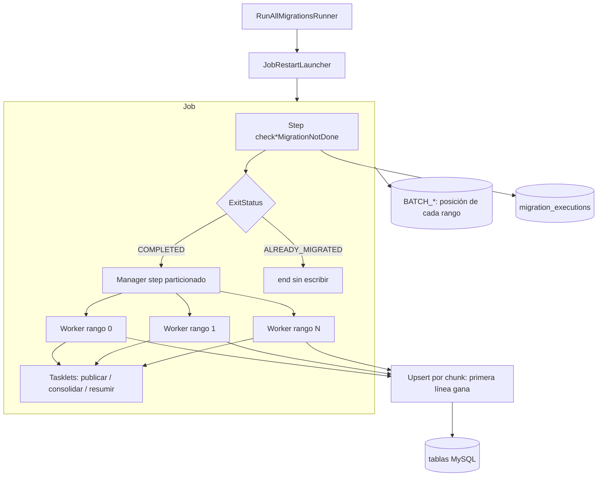

# Jobs de migración

Cada job sigue el patrón Spring Batch chunk-oriented con **particionado local** por rangos de líneas, un **guard** previo que consulta el ledger `migration_executions` y escrituras **idempotentes** (upsert por chunk). Ante un fallo, el job se **reanuda** desde el último chunk confirmado de cada partición.

## Patrón común



- **Manager** (`*Manager`): `CsvLineRangePartitioner` cuenta las filas del CSV y crea hasta `throttle-limit` rangos contiguos `(startItem, endItem]`. Los workers corren en paralelo sobre `batchTaskExecutor`.
- **Worker** (`*Worker:rangeN`): chunk step single-thread con su propio `FlatFileItemReader` (`currentItemCount`/`maxItemCount`, `saveState=true`). Cada rango guarda su posición en `BATCH_STEP_EXECUTION_CONTEXT` en la misma transacción que el chunk.
- **Tasklets** (`ActionTasklet`): pasos de una sola acción idempotente (publicar, consolidar, resumir).

Todos los steps se construyen en `MigrationStepFactory` (skip/retry/backoff, listeners y `startLimit = max-restarts + 1`).

## Reejecución automática

`RunAllMigrationsRunner` lanza los tres jobs en orden mediante `JobRestartLauncher`. Cada job se identifica por el parámetro `input.file` (el CSV de entrada) y un `run.id`:

| Última ejecución del job para ese `input.file` | Acción |
|---|---|
| No existe, o `COMPLETED` | Nueva instancia con el siguiente `run.id` (el guard la termina si el ledger ya dice `SUCCESS`) |
| `FAILED` o `STOPPED` | `JobOperator.restart(executionId)`: misma instancia, solo los rangos no completados, desde su último chunk confirmado |
| `STARTED`/`STARTING`/`STOPPING` (proceso caído) | Se marca `FAILED` (no `ABANDONED`, que impediría reiniciar) y se reinicia |

- Los reinicios se cuentan desde el `JobRepository` (`ejecuciones de la instancia − 1`), así que el límite `migration.batch.max-restarts` (default 3) vale también entre procesos.
- Si un job sigue fallando al agotar el límite, no se lanzan los jobs siguientes y el proceso termina con **exit code 1**.
- En `docker-compose.yaml`, `data-migration` tiene `restart: "on-failure:3"`: un proceso que muere (OOM, `docker kill`, caída de MySQL) se vuelve a levantar y reanuda la ejecución pendiente. `core-service` sigue esperando `service_completed_successfully`.

## Idempotencia

Cada writer hace **un `jdbcTemplate.batchUpdate` por chunk** con `INSERT … AS incoming ON DUPLICATE KEY UPDATE` (MySQL 8 row alias, ver `FirstWinsUpsert`). Para una misma clave gana la fila de **menor número de línea** (`source_line`):

- reescribir el mismo chunk (rollback + retry, reinicio o reproceso del CSV) no cambia nada;
- un duplicado en otra partición o leído después de un reinicio converge siempre al mismo resultado.

| Tabla | Clave idempotente | Transacción |
|---|---|---|
| `daily_transaction_lines` (staging) | `line_key = SHA-256(fecha\|monto\|tipo)` | chunk del worker |
| `daily_transaction_reports` | `transaction_id` | tasklet `publishDailyTransactions` |
| `daily_transaction_summaries` | `summary_date` (recálculo completo) | tasklet `summarizeDailyTransactions` |
| `account_balances` | `account_id` | chunk del worker |
| `annual_movements` (staging) | `movement_key = SHA-256(business key)` | chunk del worker |
| `annual_audit_reports` | `account_id` (recálculo completo) | tasklet `consolidateAnnualAudit` |

Los detectores de duplicados en memoria (`AnomalyDetector`, `DuplicateAccountDetector`, `DuplicateMovementDetector`) son `@StepScope`, es decir **por partición**. Un duplicado dentro de la misma partición sigue contando como skip. Uno en otra partición lo absorbe el upsert: no se escribe dos veces, pero **no suma al `skip_count`** del ledger.

## Parámetros

| Propiedad | Variable de entorno | Default | Uso |
|---|---|---|---|
| `migration.batch.chunk-size` | `MIGRATION_CHUNK_SIZE` | 500 | Filas por commit |
| `migration.batch.throttle-limit` | `MIGRATION_THROTTLE_LIMIT` | 4 | Rangos por job y tamaño del pool `batchTaskExecutor` |
| `migration.batch.max-restarts` | `MIGRATION_MAX_RESTARTS` | 3 | Reinicios por job antes de abandonar (exit 1) |
| `migration.batch.skip-limit` | `MIGRATION_SKIP_LIMIT` | 2000 | Skips de dominio/parse tolerados **por worker** |
| `migration.batch.retry-limit` | — | 3 | Intentos ante errores JDBC transitorios |

BackOff fijo en código: `ExponentialBackOffPolicy` (initial 1000 ms, multiplier 2.0, max 10000 ms) entre reintentos JDBC. Los deadlocks entre particiones (`DeadlockLoserDataAccessException`, `CannotAcquireLockException`) son transitorios y se reintentan.

## dailyTransactionsJob

| Elemento | Valor |
|---|---|
| CSV | `data/semana_3/transacciones.csv` (default) |
| Steps | `checkDailyMigrationNotDone` → `processDailyTransactionsManager` → `publishDailyTransactions` → `summarizeDailyTransactions` |
| Puertos | `DailyReportWriter` → `JdbcDailyReportWriter` (staging), `DailyReportPublication`, `DailySummaryProjection` |
| Tablas | `daily_transaction_lines` → `daily_transaction_reports` → `daily_transaction_summaries` |

Los duplicados del diario se detectan por **business key** (`fecha|monto|tipo`), no por `id`. Por eso los workers escriben en el staging `daily_transaction_lines`, con clave en la business key. `publishDailyTransactions` copia el staging a `daily_transaction_reports` (si dos business keys comparten `transaction_id`, gana la línea menor).

`summarizeDailyTransactions` recalcula `daily_transaction_summaries` desde los reportes: por fecha, `total_debits`, `total_credits`, `transaction_count` y `anomaly_count` (reportes con `anomalies` no vacío).

### Catálogo de tipos de transacción (regla de negocio)

Solo se aceptan estos valores de `tipo` (trim, minúsculas y **sin tildes**: p. ej. `débito` ≡ `debito`, `crédito` ≡ `credito`):

| Valor en CSV | Dominio |
|---|---|
| `debito` / `débito` | `DEBIT` |
| `credito` / `crédito` | `CREDIT` |

Cualquier otro valor (p. ej. `invalid`, `desconocido`) es **tipo desconocido** → `DomainError` → skip. No se reinterpretan sentinels ni placeholders.

Otras omisiones: `monto` vacío o ≤ 0, `fecha` inválida (p. ej. mes 13), `id` vacío, duplicados por business key (`fecha|monto|tipo`) en el mismo run.

La anomalía `HIGH_AMOUNT` (monto > 2000) se registra en el reporte y el ítem **sí se escribe**.

## monthlyInterestsJob

| Elemento | Valor |
|---|---|
| CSV | `data/semana_3/intereses.csv` |
| Steps | `checkMonthlyMigrationNotDone` → `calculateMonthlyInterestsManager` |
| Puerto | `AccountBalanceWriter` → `JdbcAccountBalanceWriter` |
| Tabla | `account_balances` |

### Catálogo de tipos de cuenta (regla de negocio)

Solo se calculan intereses para estos valores de `tipo` (trim, minúsculas y **sin tildes**: p. ej. `préstamo` ≡ `prestamo`):

| Valor en CSV | Dominio | Tasa |
|---|---|---|
| `ahorro` | `SAVINGS` | 1.00% si edad menor a 65; 1.50% si edad 65 o más |
| `prestamo` / `préstamo` | `LOAN` | 1.50% |
| `hipoteca` | `MORTGAGE` | 0.80% |

Cualquier otro valor (p. ej. `-1`, `unknown`) es **tipo desconocido** → `DomainError` → skip. No se reinterpretan sentinels ni placeholders como productos con tasa.

Otras omisiones: `saldo` vacío o ≤ 0, `edad` vacía o fuera de 18–100, `nombre` vacío, `cuenta_id` vacío o duplicado en el mismo run.

## annualGenerationJob

| Elemento | Valor |
|---|---|
| CSV | `data/semana_3/cuentas_anuales.csv` |
| Steps | `checkAnnualMigrationNotDone` → `stageAnnualMovementsManager` → `consolidateAnnualAudit` |
| Puertos | `AnnualMovementStore` → `JdbcAnnualMovementStore`, `AnnualAuditConsolidation` → `JdbcAnnualAuditConsolidation` |
| Tablas | `annual_movements` → `annual_audit_reports` |

Cada movimiento aceptado se guarda en `annual_movements` junto con su aporte a cada total (`deposit_amount`, `withdrawal_amount`, `net_amount`), calculado por el dominio (`AnnualMovement.*Contribution()`). `consolidateAnnualAudit` suma esos aportes por cuenta con un único `INSERT … SELECT … GROUP BY`. El SQL solo suma; las reglas viven en el dominio. Así, un reinicio no pierde los movimientos confirmados antes del fallo.

### Catálogo de tipos de movimiento (regla de negocio)

Solo se consolidan estos valores de `transaccion` (trim, minúsculas y **sin tildes**: p. ej. `depósito` ≡ `deposito`):

| Valor en CSV | Dominio | Notas |
|---|---|---|
| `deposito` / `depósito` | `DEPOSIT` | Monto `0` → skip |
| `retiro` | `WITHDRAWAL` | Montos negativos o positivos permitidos |
| `compra` | `PURCHASE` | Montos negativos o positivos permitidos |

Cualquier otro valor (p. ej. `pago`, `transfer`, vacío) es **tipo desconocido** → `DomainError` → skip. No hay mapeo de `pago` a retiro/compra: el catálogo del reporte anual es cerrado a esos tres tipos.

Otras omisiones: monto vacío/inválido, fecha inválida, `cuenta_id` vacío, duplicados por business key.

## Skip / retry / listeners

- **SkipPolicy** `DomainSkipPolicy`: `DomainError` y `FlatFileParseException` hasta `skip-limit` (por worker)
- **RetryPolicy** `TransientDataAccessRetryPolicy`: solo `TransientDataAccessException`
- **BackOffPolicy** `ExponentialBackOffPolicy`: 1s → ×2 → tope 10s entre retries
- **SkipListener**: log WARN con `thread=`, fase, tipo de excepción e item
- **RetryListener** `LoggingRetryListener`: log INFO con `attempt`, `thread`, tipo de excepción y motivo en cada reintento JDBC transitorio
- **StepMetricsListener**: duración, read/write/skip y throughput por worker y tasklet
- **JobSummaryListener**: duración del job + `chunkSize` / `throttleLimit` al inicio
- **ChunkThroughputListener**: DEBUG por chunk (nombre de thread)

Processors stateful usan `processorNonTransactional()` y beans `@StepScope`.

## Rendimiento: antes / después

Datos: `data/performance` (`python3 scripts/generate-performance-data.py`: 50 100 transacciones, 10 033 cuentas, 20 000 movimientos). MySQL 8.4 local en Docker, `--migration.batch.skip-limit=100000` en ambas corridas (el set sintético tiene miles de duplicados), base vacía en cada corrida. Duración = el worker más lento del step; throughput = filas leídas / duración.

| Step | Antes (chunk 5, 3 hilos) | Después (chunk 500, 4 rangos) | Mejora |
|---|---|---|---|
| Diario: proceso | 30 099 ms · 1 665 filas/s | 1 605 ms · 31 215 filas/s | ×18.8 |
| Diario: publicar + resumir | — | 219 + 28 ms | |
| **Job diario completo** | **30 166 ms** | **2 038 ms** | **×14.8** |
| Mensual: proceso | 4 560 ms · 2 200 filas/s | 261 ms · 38 441 filas/s | ×17.5 |
| **Job mensual completo** | **4 594 ms** | **333 ms** | **×13.8** |
| Anual: proceso (staging) | 7 424 ms · 2 694 filas/s | 527 ms · 37 951 filas/s | ×14.1 |
| Anual: consolidar | (en `close()` del writer) | 57 ms | |
| **Job anual completo** | **9 314 ms** | **668 ms** | **×13.9** |

Ajuste de `throttle-limit` con `chunk-size=500` (duración de cada job completo):

| `throttle-limit` | Diario | Mensual | Anual |
|---|---|---|---|
| 1 | 15 954 ms | 752 ms | 1 322 ms |
| 2 | 2 469 ms | 546 ms | 852 ms |
| **4 (default)** | **2 038 ms** | **333 ms** | **668 ms** |
| 8 | 2 689 ms | 365 ms | 876 ms |

Con 8 rangos el pool compite por conexiones y locks de MySQL local; 4 es el óptimo medido. Con 1 rango el diario es lento porque una sola transacción por chunk absorbe miles de duplicados de business key vía upsert.

Para reproducir:

```bash
python3 scripts/generate-performance-data.py
docker compose exec -T mysql mysql -umigration -p"$MYSQL_PASSWORD" xyz_bank_migration < scripts/revert-migration.sql
MIGRATION_RUN_ALL=true MIGRATION_SKIP_LIMIT=100000 MIGRATION_THROTTLE_LIMIT=4 \
  ./mvnw spring-boot:run -Dspring-boot.run.profiles=performance
```

Buscá en logs `Starting job=... chunkSize=... throttleLimit=...` y `Step metrics name=...Worker:rangeN ... throughputPerSec`.

## Equivalencia con el legacy

- `TheLegacyEquivalenceIT` corre los tres jobs sobre `data/semana_3` con 4 rangos y compara contra los golden files de `src/test/resources/expected/semana_3/`: conteos, reportes diarios, saldos y tasas por cuenta, y totales anuales por cuenta. Los golden files se capturaron con la implementación previa (single-thread). `daily_transaction_summaries.csv` se derivó de forma independiente desde el golden de reportes.
- `TheResumeAfterFailureIT` falla un chunk de cada job después de escribirlo (fallo de DB simulado en el writer), deja que el launcher reinicie y verifica que las tablas finales son idénticas a las de una corrida limpia.

**Diferencia conocida con el legacy:** en el set sintético de `data/performance` la versión previa perdía 14 transacciones que aparecen como **dos filas idénticas adyacentes** (p. ej. id `10499`). Tras un rollback, el `TaskExecutorRepeatTemplate` reprocesaba la primera copia y el detector de duplicados (que ya la había visto) la descartaba también. Ahora se conserva la primera copia, como exige la regla («se rechaza la segunda fila»). `semana_3` no contiene ese caso, por lo que los golden files no cambian.

## Ledger anti-duplicados

Tabla `migration_executions` (`job_name`, `status`, `executed_at`, `write_count`, `skip_count`).

1. Si existe fila `SUCCESS` para el job → exit `ALREADY_MIGRATED` y el job termina sin procesar.
2. Tras un job `COMPLETED` → `markSuccess`. Los conteos suman los workers y tasklets de **todas** las ejecuciones de la instancia (el intento fallido + los reinicios). Los managers se excluyen porque agregan a sus workers.
3. Tras `FAILED` → `markFailed`. Un reinicio exitoso lo reemplaza por `SUCCESS`.

Los conteos del ledger son **operativos**. Tras un reinicio pueden superar a los de una corrida limpia: el rango reiniciado arranca con su detector de duplicados vacío y reescribe (sin efecto, por el upsert) filas ya vistas, y los skips del chunk revertido se cuentan de nuevo. El contenido de las tablas es el mismo.

Para volver a migrar: ejecutar [`scripts/revert-migration.sql`](../scripts/revert-migration.sql). Ver [mysql.md](mysql.md).

## Cómo encaja la arquitectura

El sistema está organizado como un **monolito modular hexagonal**: cada job es un bounded context (`dailytransactions`, `monthlyinterests`, `annualreports`) con dominio propio, puertos de escritura y adapters JDBC. Lo transversal (pool, particionado, skip/retry/backoff, reinicio, métricas, ledger) vive en `shared`.

Flujo de un job de punta a punta:

1. **Entrada**: CSV partido en rangos (`CsvLineRangePartitioner`); cada worker lo lee con `NumberedLineMapper`, que anota la línea de origen.
2. **Validación y transformación**: `ItemProcessor` + invariantes de dominio (`DomainError` → skip).
3. **Salida**: `ItemWriter` Batch → puerto de aplicación → adapter JDBC (upsert por lote) → tabla MySQL.
4. **Orquestación**: el guard consulta `migration_executions`, los workers corren en paralelo y los tasklets publican/consolidan. Al terminar, el ledger marca `SUCCESS` o `FAILED` y `JobRestartLauncher` reinicia lo que haya fallado.

Capas de resiliencia:

| Capa | Responsabilidad |
|---|---|
| Dominio / processor | Rechaza datos inválidos o duplicados de negocio |
| `DomainSkipPolicy` | Omite corruptos/parse errors sin abortar el lote |
| `TransientDataAccessRetryPolicy` + backoff | Reintenta fallos JDBC transitorios con espera exponencial |
| Upsert «primera línea gana» | Reescrituras y duplicados entre particiones convergen al mismo resultado |
| `JobRestartLauncher` + `startLimit` | Reanuda desde el último chunk confirmado, con límite de reinicios |
| `restart: on-failure:3` | Relanza el proceso si muere |
| Listeners | Observabilidad (skips por hilo, throughput, resumen de job) |
