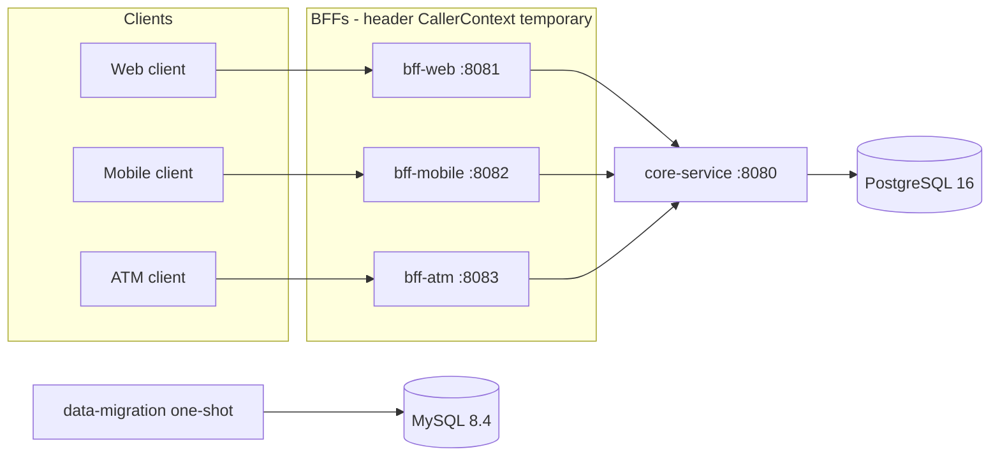
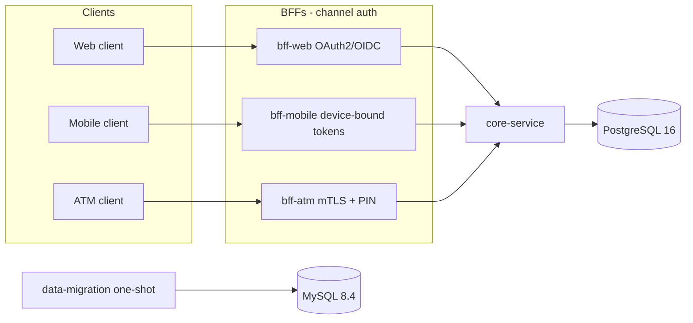

# Architecture

XYZ Bank exposes three channel-specific backends for frontend (BFFs) in front of a single internal `core-service`. Only `core-service` talks to PostgreSQL. The legacy CSV sanitization job writes reports to a separate MySQL instance; those reports are not loaded into core-service tables.

## Current topology

Caller identity is a **temporary** header adapter (`X-Customer-Id`, `X-Channel`, and ATM `X-Terminal-Id`) resolved in each BFF's `CallerContextInterceptor`. It is not authentication.

## Target topology

The BFF split and `core-service` boundary stay. What changes is how each channel proves who the caller is: OAuth2/OIDC for web, device-bound tokens for mobile, and mTLS plus PIN for ATM. The header `CallerContext` adapter is replaced; payload shapes, aggregation in the BFFs, and the PostgreSQL/MySQL split do not.

What changes: the identity adapter in each BFF (headers today, channel-native credentials later) and any edge TLS/mTLS termination. What does not change: one BFF per channel, `core-service` as the only database owner for banking entities, MySQL reserved for migration reports, and the existing BFF payload contracts.
