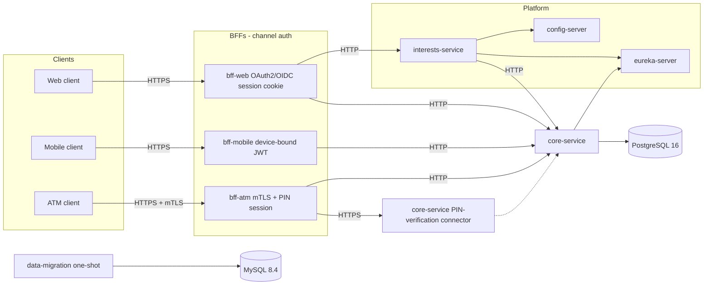
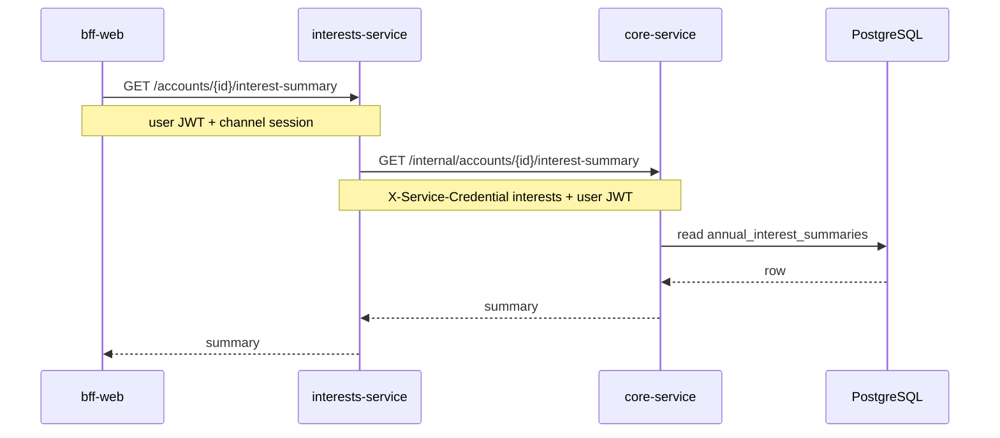
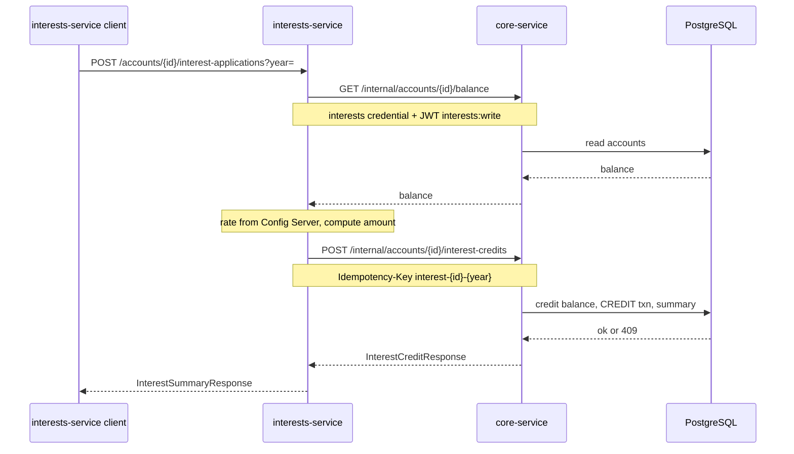

# Architecture

XYZ Bank exposes three channel-specific backends for frontend (BFFs) in front of an internal platform: `core-service` (sole PostgreSQL owner), plus `config-server`, `eureka-server`, and `interests-service` for annual interest calculation and cutover. The legacy CSV sanitization job writes reports to a separate MySQL instance; those reports are not loaded into core-service tables.

## Topology

Each channel proves who the caller is with a real credential instead of a trusted header: OAuth2/OIDC session cookie for web, a device-bound JWT for mobile, and mTLS plus a PIN-verified session for ATM. Every client-facing edge is TLS; BFF→platform edges stay plain HTTP except the one call that carries a raw PIN, which is TLS-only by design.

`bff-web` routes interest-summary traffic to `interests-service` (feature flag on by default). Mobile and ATM keep talking to `core-service` directly. `interests-service` loads config from `config-server`, registers with Eureka, discovers `core-service` by service id (LoadBalancer), wraps outbound core calls with a Resilience4j circuit breaker, authenticates interest credits with service credential + JWT scope `interests:write`, and is the only writer of interest credits.

`core-service`'s PIN-verification connector (`CoreServicePin` above) is a second Tomcat connector on the same service, not a separate deployable — it shares `core-service`'s process and database access, drawn separately here only to show it terminates TLS while every other `core-service` endpoint stays plain HTTP.

What stays constant regardless of channel: one BFF per channel, `core-service` as the only database owner for banking entities, MySQL reserved for migration reports, and the existing BFF payload contracts. What each channel's credential proves and how it's validated is documented in `docs/contracts/*/openapi.yaml`.

## Interest flows

### Query — annual interest summary

### Command — apply annual interest

Optimistic locking on `accounts.version` and the unique `(account_id, year)` on summaries prevent double application; repeating the same `Idempotency-Key` replays the original credit. Outbound calls from `interests-service` to `core-service` use Resilience4j circuit breaker/retry so repeated core failures open the breaker and fail fast.
