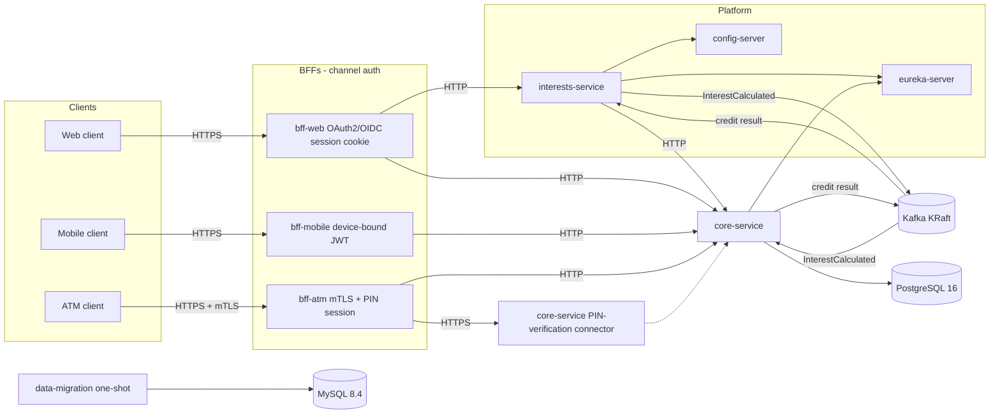
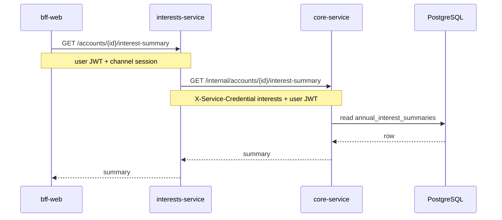
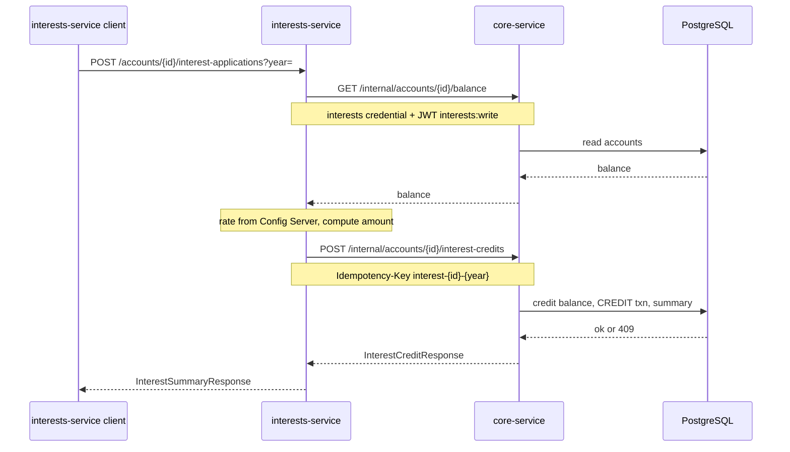
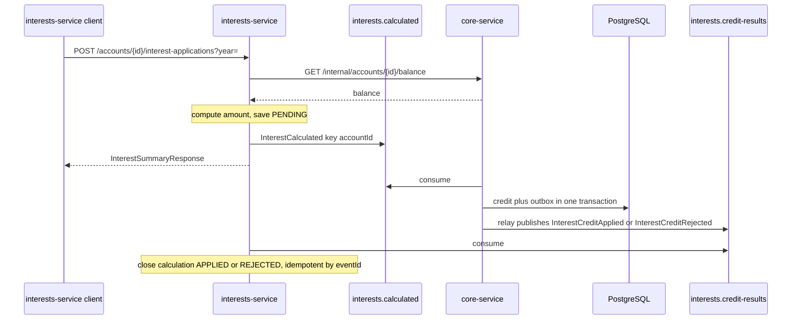

# Architecture

XYZ Bank exposes three channel-specific backends for frontend (BFFs) in front of an internal platform: `core-service` (sole PostgreSQL owner), plus `config-server`, `eureka-server`, and `interests-service` for annual interest calculation and cutover. A single Apache Kafka broker in KRaft mode carries the interest-credit saga. The legacy CSV sanitization job writes reports to a separate MySQL instance; those reports are not loaded into core-service tables.

## Topology

Each channel proves who the caller is with a real credential instead of a trusted header: OAuth2/OIDC session cookie for web, a device-bound JWT for mobile, and mTLS plus a PIN-verified session for ATM. Every client-facing edge is TLS; BFF→platform edges stay plain HTTP except the one call that carries a raw PIN, which is TLS-only by design.

`bff-web` routes interest-summary traffic to `interests-service` (feature flag on by default). Mobile and ATM keep talking to `core-service` directly. `interests-service` loads config from `config-server`, registers with Eureka, discovers `core-service` by service id (LoadBalancer), and wraps outbound HTTP calls to core with a Resilience4j circuit breaker. The annual interest summary GET stays synchronous and forwards the user bearer. Interest credit stays on that HTTP path while `FEATURE_INTEREST_CREDIT_VIA_KAFKA` is `false` (the default): `interests-service` authenticates with its service credential and JWT scope `interests:write`. With the flag `true`, the same calculation is published as `InterestCalculated` and `core-service` credits the account, then publishes the result. Decision record: [`docs/adr/002-event-architecture.md`](adr/002-event-architecture.md).

`core-service`'s PIN-verification connector (`CoreServicePin` above) is a second Tomcat connector on the same service, not a separate deployable — it shares `core-service`'s process and database access, drawn separately here only to show it terminates TLS while every other `core-service` endpoint stays plain HTTP.

What stays constant regardless of channel: one BFF per channel, `core-service` as the only database owner for banking entities, MySQL reserved for migration reports, and the existing BFF payload contracts. What each channel's credential proves and how it's validated is documented in `docs/contracts/*/openapi.yaml`. Kafka coordinates the interest credit when the feature flag is on. It does not own account state.

## Interest flows

### Query — annual interest summary

### Command — apply annual interest (HTTP, default)

`FEATURE_INTEREST_CREDIT_VIA_KAFKA=false`. This is the path Compose starts with, and the path the current end-to-end tests exercise.

Optimistic locking on `accounts.version` and the unique `(account_id, year)` on summaries prevent double application; repeating the same `Idempotency-Key` replays the original credit. Outbound calls from `interests-service` to `core-service` use Resilience4j circuit breaker/retry so repeated core failures open the breaker and fail fast. With the Kafka flag on, `creditInterest` is not called, so that breaker no longer covers the credit. `fetchInterestSummary` and `fetchAccountBalance` stay on it.

### Command — apply annual interest (Kafka saga)

`FEATURE_INTEREST_CREDIT_VIA_KAFKA=true`. The POST returns the calculated summary as soon as `InterestCalculated` is published. The calculation stays `PENDING` in the in-memory repository until `interests.credit-results` closes it. The HTTP credit endpoint remains available for the flag-off path.

The partition key is `accountId`. Delivery is at-least-once. `eventId` is `interest:{accountId}:{year}`. The HTTP idempotency key on the synchronous path stays `interest-{accountId}-{year}`. A duplicate `eventId` does not credit the balance twice. A failed credit transaction leaves no outbox row. A business rejection (`VALIDATION` or `NOT_FOUND`) publishes `InterestCreditRejected` with `reason` and does not change the balance. `core-service` is the only service with an outbox, because it is the only service with a local database transaction around the credit. See [`docs/adr/002-event-architecture.md`](adr/002-event-architecture.md).
