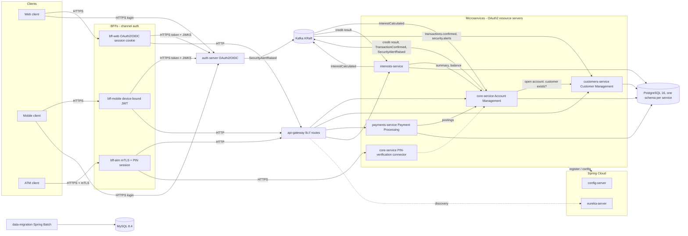
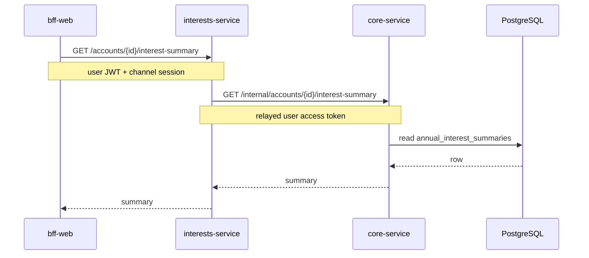
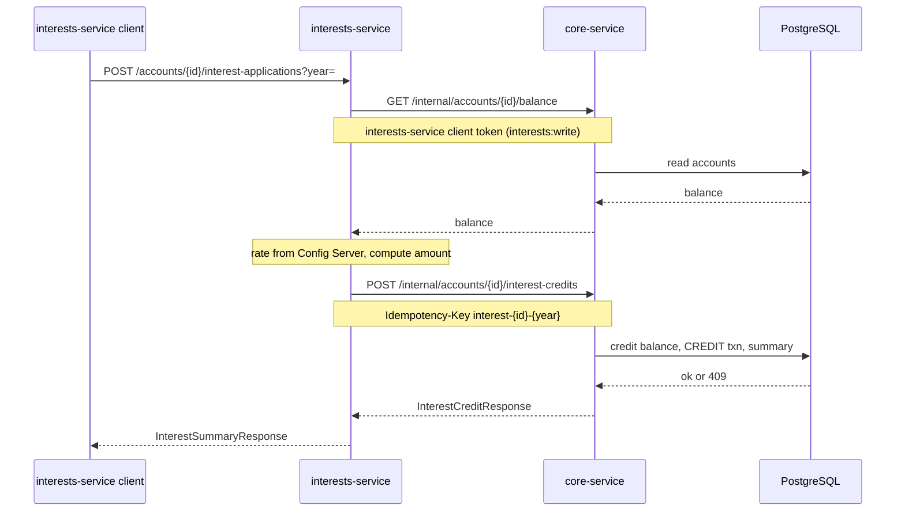
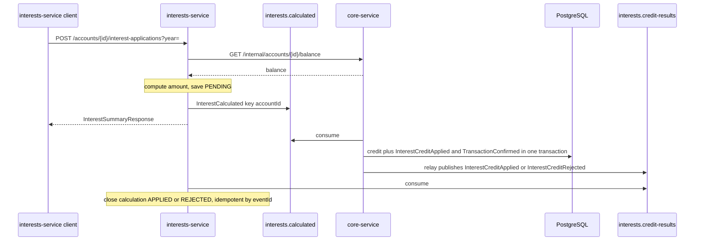
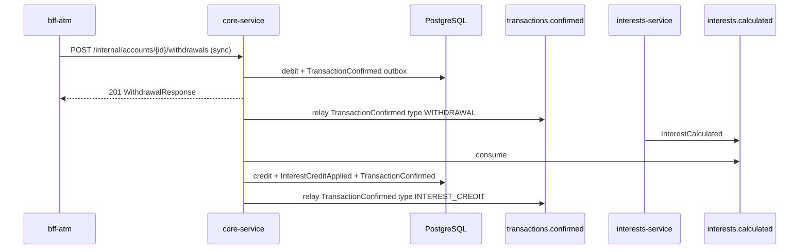

# Architecture

XYZ Bank exposes three channel-specific backends for frontend (BFFs) in front of an internal platform reached through `api-gateway`. The platform has three business microservices — `core-service` (Account Management), `customers-service` (Customer Management) and `payments-service` (Payment Processing) — plus `interests-service` for annual interest, `auth-server` (the only OAuth 2.0 / OIDC token issuer), `config-server` and `eureka-server`. The services share one PostgreSQL with one schema per service. A single Apache Kafka broker in KRaft mode carries the interest-credit saga, confirmed transactions and security alerts. The legacy batch processes run as Spring Batch jobs (`data-migration`) that write their reports to a separate MySQL instance; those reports are not loaded into the platform's tables.

## Critical migration processes

The move from the COBOL/Shell mainframe system to microservices rests on five processes. Each one replaces a legacy limitation and maps to a part of this repository.

| # | Process | Legacy limitation it removes | Where it lives | Decision records |
|---|---|---|---|---|
| 1 | Migrating the batch processes to Spring Batch | Shell/COBOL jobs with no restart, no partial retry and no parallelism | `data-migration`: `dailyTransactionsJob`, `monthlyInterestsJob`, `annualGenerationJob` | [`data-migration/docs/jobs.md`](../data-migration/docs/jobs.md) |
| 2 | Splitting the monolith into microservices | One deployable where a fault in any module takes down the whole system and scaling is all-or-nothing | `core-service`, `customers-service`, `payments-service`, `interests-service`, with Eureka, Config Server and `api-gateway` | [ADR 004](adr/004-service-decomposition.md) |
| 3 | Backend for Frontend per channel | Web, mobile and ATM receiving the same payloads from one backend, and frontend teams bound to its release train | `bff-web`, `bff-mobile`, `bff-atm` | [ADR 001](adr/001-bff-strategy.md) |
| 4 | Distributed security with Spring Security / Spring Cloud | Centralized, perimeter-only security that does not hold in a distributed system | `auth-server` (Spring Authorization Server), resource servers in every service, channel credentials in each BFF, TLS and mTLS | [Authorization server](#authorization-server) |
| 5 | Asynchronous messaging with Apache Kafka | Synchronous coupling: a credit or a notification fails whenever the other side is down | Topics `interests.calculated`, `interests.credit-results`, `transactions.confirmed`, `security.alerts`, each with a `.DLT` | [ADR 002](adr/002-event-architecture.md), [ADR 003](adr/003-kafka-default-and-dead-letter-topics.md) |

### Batch processes in detail

- **Jobs.** Each job is a guard step (skip when the ledger `migration_executions` already holds SUCCESS), a partitioned chunk step (read CSV, process, write), and a closing step: the daily job publishes its reports and rebuilds `daily_transaction_summaries`, the annual job consolidates `annual_audit_reports` from the staged movements.
- **Errors.** A skip policy drops invalid records (domain errors, unparseable lines) up to `skip-limit`. A retry policy retries transient database errors with exponential backoff (1 s, ×2, up to 10 s).
- **Restart.** `JobRestartLauncher` restarts the last FAILED execution of a job instance from its last committed chunk, up to `max-restarts`; Compose restarts the container on failure up to 3 times.
- **Parallelism and scale.** Every job is partitioned by CSV line range over a bounded thread pool (`throttle-limit`), with configurable chunk size and batched upserts.
- **Integrity.** Writes are idempotent upserts keyed by business key, so a restarted or repeated run converges to the same rows. Tests compare the results with golden files captured from the legacy output, and prove that an interrupted run ends equal to a clean one.

## Business requirements and architecture decisions

The architecture answers three business requirements stated by the bank. Each decision below is justified by the requirement it serves.

### 1. Scale and evolve each capability independently

The mainframe could only grow as a whole, and any change shipped the entire system.

- **Decision: microservices per business capability with one schema each** ([ADR 004](adr/004-service-decomposition.md)). Accounts, customers and payments are deployed, scaled and versioned separately. Each service writes only its own schema, so a change in one cannot break another's data.
- **Decision: stateless services behind Eureka and `api-gateway`.** Nothing is kept in process memory, the outbox is claimed with `SELECT ... FOR UPDATE SKIP LOCKED` and consumers are idempotent by `eventId`, so `docker compose up --scale` (or an ECS service's desired count, see [`deploy/aws/README.md`](../deploy/aws/README.md)) adds instances on demand.
- **Decision: centralized configuration in `config-server`.** One file per service in `config-repo/` changes timeouts, rates and flags without rebuilding images.

### 2. Keep critical operations available and data consistent when a part fails

A fault in one legacy module stopped every operation, and a banking system cannot lose or duplicate money.

- **Decision: Resilience4j around every remote call.** Timeouts, circuit breakers, retries only on idempotent operations, and explicit alternatives: a BFF answers 503 instead of stale balances, an account is not opened if `customers-service` is down, a payment stays `PENDING` when `core-service` is down and completes when the same `Idempotency-Key` is repeated.
- **Decision: idempotent writes with optimistic locking.** Every write takes an `Idempotency-Key` and locks the affected aggregate, so a retry never moves money twice.
- **Decision: Kafka with a transactional outbox, bounded retries and dead-letter topics.** An event is written in the same database transaction as the change it reports and is never lost or reordered per account. A record that keeps failing goes to `<topic>.DLT` instead of blocking its partition.
- **Decision: restartable, idempotent batch jobs.** An interrupted migration resumes and produces the same result as the legacy process.
- **Decision: observability.** Prometheus metrics, distributed traces over HTTP and Kafka (Zipkin), and one log pattern with `traceId`, `spanId` and `correlationId` on every service, to find and fix failures across services.

### 3. Serve each channel securely and efficiently

Web, mobile and ATM received the same data, with security limited to the perimeter.

- **Decision: one BFF per channel** ([ADR 001](adr/001-bff-strategy.md)). Web gets complete, aggregated payloads; mobile gets minimal ones to save bandwidth; the ATM gets only PIN verification, balance and withdrawal.
- **Decision: a credential per channel and tokens everywhere.** OIDC with PKCE and an HttpOnly session cookie for web, a device-bound JWT for mobile, and mTLS plus card PIN for the ATM. `auth-server` refuses scopes from another channel, and every service is an OAuth2 resource server that checks signature, issuer, audience and scope.
- **Decision: TLS on every client-facing edge.** The BFFs and `auth-server` serve HTTPS only, and the PIN travels only over the TLS connector of `core-service`.
- **Decision: security events.** A locked card or a reused refresh token publishes `security.alerts`, and the customer sees it in the notification feed.

## Topology

Each channel proves who the caller is with a real credential instead of a trusted header: OAuth2/OIDC session cookie for web, a device-bound JWT for mobile, and mTLS plus a PIN-verified session for ATM. Every client-facing edge is TLS; BFF→platform edges stay plain HTTP except the one call that carries a raw PIN, which is TLS-only by design.

The three BFFs reach the platform through `api-gateway` (Spring Cloud Gateway, one `PLATFORM_GATEWAY_URL`): `/<service>/**` is routed with `lb://` to an instance registered in Eureka, and `Authorization`, `X-Correlation-Id` and `Idempotency-Key` are forwarded untouched. The gateway does not validate tokens; every service does. The only exception is `bff-atm`'s PIN verification, which goes straight to the TLS connector of `core-service`. Every platform service, the gateway and the BFFs register with Eureka and load their configuration from `config-server`. `bff-web` reads the profile and the notification feed from `customers-service`, accounts and transactions from `core-service`, and interest summaries from `interests-service` (feature flag on by default). `payments-service` takes transfers, deposits and bill payments from internal clients holding `payments:write` (no BFF exposes them yet) and applies them through `core-service`'s `/internal/postings`. `interests-service` discovers `core-service` by service id (LoadBalancer) and wraps outbound HTTP calls to core with a Resilience4j circuit breaker. The annual interest summary GET stays synchronous and forwards the user bearer. Interest credit travels by the Kafka saga by default in Compose (`FEATURE_INTEREST_CREDIT_VIA_KAFKA=true`): the calculation is published as `InterestCalculated` and `core-service` credits the account, then publishes the result. With the flag `false` the credit is the synchronous HTTP path instead, where `interests-service` authenticates to `core-service` with its own client-credentials access token (scope `interests:write`). Decision record: [`docs/adr/002-event-architecture.md`](adr/002-event-architecture.md).

```mermaid
flowchart LR
  subgraph clients [Clients]
    WebClient[Web client]
    MobileClient[Mobile client]
    AtmClient[ATM client]
  end

  subgraph bffs [BFFs - channel auth]
    BffWeb[bff-web OAuth2/OIDC session cookie]
    BffMobile[bff-mobile device-bound JWT]
    BffAtm[bff-atm mTLS + PIN session]
  end

  AuthServer[auth-server OAuth2/OIDC]
  Gateway[api-gateway lb:// routes]

  subgraph services [Microservices - OAuth2 resource servers]
    CoreService[core-service Account Management]
    CoreServicePin[core-service PIN-verification connector]
    CustomersService[customers-service Customer Management]
    PaymentsService[payments-service Payment Processing]
    InterestsService[interests-service]
  end

  subgraph infra [Spring Cloud]
    ConfigServer[config-server]
    EurekaServer[eureka-server]
  end

  Kafka[(Kafka KRaft)]
  Postgres[(PostgreSQL 16, one schema per service)]
  MySQL[(MySQL 8.4)]
  Migration[data-migration Spring Batch]

  WebClient -- HTTPS --> BffWeb
  MobileClient -- HTTPS --> BffMobile
  AtmClient -- HTTPS + mTLS --> BffAtm
  WebClient -- "HTTPS login" --> AuthServer
  MobileClient -- "HTTPS login" --> AuthServer
  BffWeb -- "HTTPS token + JWKS" --> AuthServer
  BffMobile -- "HTTPS token + JWKS" --> AuthServer
  BffWeb -- HTTP --> Gateway
  BffMobile -- HTTP --> Gateway
  BffAtm -- HTTP --> Gateway
  BffAtm -- HTTPS --> CoreServicePin
  Gateway --> CoreService
  Gateway --> CustomersService
  Gateway --> PaymentsService
  Gateway --> InterestsService
  CoreService -- "open account: customer exists?" --> CustomersService
  PaymentsService -- "postings" --> CoreService
  InterestsService -- "summary, balance" --> CoreService
  InterestsService -- "InterestCalculated" --> Kafka
  Kafka -- "InterestCalculated" --> CoreService
  CoreService -- "credit result, TransactionConfirmed, SecurityAlertRaised" --> Kafka
  AuthServer -- "SecurityAlertRaised" --> Kafka
  Kafka -- "credit result" --> InterestsService
  Kafka -- "transactions.confirmed, security.alerts" --> CustomersService
  services -. "register / config" .-> infra
  Gateway -. "discovery" .-> EurekaServer
  CoreService --> Postgres
  CustomersService --> Postgres
  PaymentsService --> Postgres
  InterestsService --> Postgres
  CoreServicePin -.-> CoreService
  Migration --> MySQL
```

`core-service`'s PIN-verification connector (`CoreServicePin` above) is a second Tomcat connector on the same service, not a separate deployable — it shares `core-service`'s process and database access, drawn separately here only to show it terminates TLS while every other `core-service` endpoint stays plain HTTP.

## Authorization server

`auth-server` (`platform/auth-server`, Spring Authorization Server, HTTPS on `:9000`) is the only issuer on the platform. It registers four confidential clients. `bff-web` and `bff-mobile` use `authorization_code` with mandatory PKCE plus `refresh_token`. `bff-atm` and `interests-service` use `client_credentials` only. Each channel client may request only `openid`, `profile` and its own channel's scope set, taken from `shared-security`'s `Channel` — a request with any other scope is rejected as a whole (`invalid_scope`). User access tokens carry `sub` = the customer id and `channel` = `WEB` or `MOBILE`, decided by the client the token is issued to. Service tokens carry `channel` = `ATM` or `INTERESTS` and no customer subject. Tokens are RS256-signed with a key loaded from a provisioned PKCS12 keystore (`AUTH_SIGNING_KEYSTORE_*`); the public key is published at `/oauth2/jwks` under its RFC 7638 thumbprint. The server refuses to start without that keystore, so a restart never invalidates issued tokens. No service shares a signing secret with another.

**State.** Authorizations (codes and the tokens issued from them), consents and registered clients are stored through Spring Authorization Server's JDBC services in `auth-server`'s own PostgreSQL (`auth-postgres`: own container, database `auth_server`, user and volume, not published on the host). `auth-server` has no credentials for `core_service` and the platform services none for `auth_server`; banking data stays in the platform services' schemas. Flyway owns the schema (Spring Authorization Server's bundled tables, `blob` → `text` for PostgreSQL). The four clients are upserted into the store on every startup; each secret is stored only as a bcrypt hash. Refresh-token rotation and mobile device revocation live here too (`rotated_refresh_tokens`, device registrations), not in `core-service`. Nothing OAuth-related is kept in process memory, so restarts are invisible to clients holding valid codes.

**One issuer, two network paths.** The browser reaches `auth-server` as `localhost:9000`; the BFF containers reach it on the Docker network as `auth-server:9000`. The issuer is pinned to the public URL (`AUTH_PUBLIC_ISSUER` in `.env`, `https://localhost:9000` in `.env.example`; every verifier and both BFFs read that one value), so tokens and the discovery document carry it whichever host name a request used. Each BFF is configured with the endpoints split by who calls them — the browser-facing `authorization-uri` on `localhost`, the back-channel `token-uri` and `jwk-set-uri` on `auth-server` — instead of OIDC discovery (whose advertised endpoints are all on `localhost` and unreachable from a container). Because that explicit-endpoint mode disables Spring's own issuer check, each BFF validates the ID token's `iss` against `OIDC_ISSUER` itself. The TLS certificate names both hosts and chains to the dev CA, which the BFF containers trust through their JVM trust store. `auth-server` keeps its login session in the `XYZ_AUTH_SESSION` cookie: cookies are scoped by host, not port, and a `JSESSIONID` on `localhost` would overwrite the BFFs' session holding the pending authorization request.

After login the BFF keeps the auth-server access token as the session and relays it unchanged. `bff-web` stores it in the `session` cookie and the refresh token in `refresh_token`. `bff-mobile` returns both in the login body, with `device_id` bound into the access token. `core-service` and `interests-service` verify those tokens against the JWKS (issuer `https://localhost:9000`, audience, expiry, `azp` matching `channel`). They do not hold a signing key.

`bff-atm` does not relay a user token. It calls `core-service` with its own `client_credentials` token. A successful PIN verification returns `atmSessionId`; `bff-atm` embeds that id in a terminal-bound HS256 session that only `bff-atm` can sign (`BFF_ATM_SESSION_SECRET`) and sends the id back as `X-Atm-Session`. `core-service` resolves the customer from the session row it created. The BFF test suites keep using their WireMock `MockOidcProvider` and do not depend on a running `auth-server`.

What stays constant regardless of channel: one BFF per channel, banking data owned by the platform services (each in its own schema, never by a BFF), MySQL reserved for migration reports, and the existing BFF payload contracts. What each channel's credential proves and how it's validated is documented in `docs/contracts/*/openapi.yaml`. Kafka coordinates the interest credit when the feature flag is on. It does not own account state.

## Fault tolerance (BFFs)

Each BFF bounds every outbound call with a connect and read timeout set on the HTTP client (`core-service` reads 1 s / 2 s, bff-atm's core calls and every `auth-server` or `interests-service` call 1 s / 3 s). Resilience4j `TimeLimiter` is not used: it abandons a blocking call without stopping it, which would let a retried withdrawal overlap the original.

There is one circuit breaker per downstream per BFF: `coreService`, `authServer`, and `interestsService` in bff-web. A breaker counts only connection failures, timeouts, answers cut off mid-read, and 5xx. A 4xx never opens it. The core and interests breakers use a 20-call window, a 10-call minimum and a 50 % failure rate; `authServer` uses a 10-call window and a 5-call minimum. Each waits 15 s open before half-opening. An open breaker answers the existing 503 ProblemDetail. It never serves cached data, and it never turns health DOWN.

Retries apply only to idempotent operations, only after unreachable, timed out, cut off, 502, 503 or 504, never after a 4xx, a 500 or an open circuit:

| Retried (attempts, backoff) | Never retried, and why |
|---|---|
| `GET` reads to `core-service` / `interests-service` (3, ~200 ms then ~400 ms, jittered) | PIN verification: an extra attempt can count as another wrong PIN and lock the card |
| ATM withdrawal, same `Idempotency-Key` and body (2, 300 ms) | Refresh grant: a resend after a completed rotation is reuse, and `auth-server` revokes the login |
| `client_credentials` token, `bff-atm` and `interests-service` (3, ~300 ms then ~600 ms) | Authorization-code exchange (single-use) and device revocation |

A withdrawal is debited at most once however many attempts arrive: `core-service` replays a known `Idempotency-Key`, and the key is unique in `transactions`, so an attempt that overlaps a still-running original gets a replay or a 409. When `auth-server` is unavailable, every BFF path answers 503 rather than 401/422 and issues or clears no session. That covers login, refresh, device revocation, signing-key fetch and service token. bff-atm's and interests-service's token outages count against `authServer` only, never against `core-service`'s breaker.

Actuator (health, `circuitbreakers`, `circuitbreakerevents`) is served on each BFF's internal plain-HTTP management port (9081 / 9082 / 9083), published on loopback only by `docker-compose.override.yml` (the deployable `docker-compose.yaml` publishes only the BFFs and `auth-server`, on a `public` network, while everything else sits on a no-egress `internal` network). The customer-facing port keeps answering `/actuator/health` with the overall status only. The compose healthchecks use the management ports.

## Interest flows

### Query — annual interest summary

```mermaid
sequenceDiagram
  participant Web as bff-web
  participant Interests as interests-service
  participant Core as core-service
  participant Db as PostgreSQL

  Web->>Interests: GET /accounts/{id}/interest-summary
  Note over Web,Interests: user JWT + channel session
  Interests->>Core: GET /internal/accounts/{id}/interest-summary
  Note over Interests,Core: relayed user access token
  Core->>Db: read annual_interest_summaries
  Db-->>Core: row
  Core-->>Interests: summary
  Interests-->>Web: summary
```

### Command — apply annual interest (HTTP)

`FEATURE_INTEREST_CREDIT_VIA_KAFKA=false`. This is the fallback: Compose starts with the saga, and a service run outside Compose also defaults to this path. The HTTP-path tests exercise it.

```mermaid
sequenceDiagram
  participant Caller as interests-service client
  participant Interests as interests-service
  participant Core as core-service
  participant Db as PostgreSQL

  Caller->>Interests: POST /accounts/{id}/interest-applications?year=
  Interests->>Core: GET /internal/accounts/{id}/balance
  Note over Interests,Core: interests-service client token (interests:write)
  Core->>Db: read accounts
  Db-->>Core: balance
  Core-->>Interests: balance
  Note over Interests: rate from Config Server, compute amount
  Interests->>Core: POST /internal/accounts/{id}/interest-credits
  Note over Interests,Core: Idempotency-Key interest-{id}-{year}
  Core->>Db: credit balance, CREDIT txn, summary
  Db-->>Core: ok or 409
  Core-->>Interests: InterestCreditResponse
  Interests-->>Caller: InterestSummaryResponse
```

Optimistic locking on `accounts.version` and the unique `(account_id, year)` on summaries prevent double application; repeating the same `Idempotency-Key` replays the original credit. Outbound calls from `interests-service` to `core-service` use Resilience4j circuit breaker/retry so repeated core failures open the breaker and fail fast. With the Kafka flag on, `creditInterest` is not called, so that breaker no longer covers the credit. `fetchInterestSummary` and `fetchAccountBalance` stay on it.

### Command — apply annual interest (Kafka saga, default in Compose)

`FEATURE_INTEREST_CREDIT_VIA_KAFKA=true`, the default of `docker compose up`. A `200` from the POST therefore means the calculation was published, not that the account was credited. The POST returns the calculated summary as soon as `InterestCalculated` is published. The calculation stays `PENDING` in the `interests` schema until `interests.credit-results` closes it. The HTTP credit endpoint remains available for the flag-off path.

```mermaid
sequenceDiagram
  participant Caller as interests-service client
  participant Interests as interests-service
  participant Calculated as interests.calculated
  participant Core as core-service
  participant Db as PostgreSQL
  participant Results as interests.credit-results

  Caller->>Interests: POST /accounts/{id}/interest-applications?year=
  Interests->>Core: GET /internal/accounts/{id}/balance
  Core-->>Interests: balance
  Note over Interests: compute amount, save PENDING
  Interests->>Calculated: InterestCalculated key accountId
  Interests-->>Caller: InterestSummaryResponse
  Core->>Calculated: consume
  Core->>Db: credit plus InterestCreditApplied and TransactionConfirmed in one transaction
  Core->>Results: relay publishes InterestCreditApplied or InterestCreditRejected
  Interests->>Results: consume
  Note over Interests: close calculation APPLIED or REJECTED, idempotent by eventId
```

The partition key is `accountId`, and each topic has 3 partitions with one consumer thread per partition (see [Failed messages](#failed-messages-and-ordering)). Delivery is at-least-once. An `InterestCalculated` whose event id was already processed is acknowledged without a second result, even if its amount was recalculated from a higher balance. `eventId` is `interest:{accountId}:{year}`. The HTTP idempotency key on the synchronous path stays `interest-{accountId}-{year}`. A duplicate `eventId` does not credit the balance twice. A failed credit transaction leaves no outbox row. A business rejection (`VALIDATION`, `NOT_FOUND`, or `CONFLICT`) publishes `InterestCreditRejected` with `reason`, does not change the balance, and commits the consumer offset so the single partition is not blocked. With the Kafka flag off, an HTTP credit does not write interest-result outbox rows. `core-service` is the only service with an outbox, because it is the only service with a local database transaction around the credit. See [`docs/adr/002-event-architecture.md`](adr/002-event-architecture.md).

### Failed messages and ordering

**Partitions and concurrency.** `interests.calculated`, `interests.credit-results`, `transactions.confirmed` and `security.alerts` have 3 partitions (`kafka-init` creates them, and raises existing topics that have fewer). Every producer keys by `accountId`, so one account's records stay on one partition in order, while different accounts run in parallel on the 3 listener threads each service starts. Raising the partition count of a topic that still holds unconsumed records re-maps keys; drain such a topic first.

**Retries, then a dead-letter topic.** When a consumer (`core-service` on `interests.calculated`, `interests-service` on `interests.credit-results`) fails to process a record, it retries 3 times with 1 s, 2 s and 4 s delays and then publishes the record to `<topic>.DLT` with its key, payload and the failure in headers, commits the offset and moves on. A permanently bad record therefore frees its partition after about 7 s, and the records behind it are processed normally. The retries block the partition rather than going through retry topics, because retry topics would let later records of the same account overtake the failing one. Redelivery is safe: crediting is idempotent on the event id. A business rejection (unknown account, year already credited) is not a failure: it is reported as `InterestCreditRejected`. If publishing to the DLT itself fails, the record is redelivered rather than dropped. Nothing replays a DLT automatically; an operator inspects it with Kafka tooling, and a dead-lettered `InterestCalculated` leaves its calculation `PENDING` and the account uncredited. `customers-service` consumes `transactions.confirmed` and `security.alerts` with the same policy (3 retries, then `.DLT`) to build each customer's notification feed, idempotent by `eventId`.

**Order from the outbox.** The relay publishes outbox rows in the order they were written (`outbox_events.seq`, Flyway `V13`), not by date and id, so the events of one account reach `interests.credit-results` and `transactions.confirmed` in the order they were confirmed. If a send fails, the account's later events wait for the next run so they cannot overtake it, and other accounts keep flowing.

### Event — TransactionConfirmed (every confirmed money movement)

When `FEATURE_TRANSACTION_CONFIRMED_EVENTS` is on, every confirmed withdrawal and every confirmed interest credit writes a `TransactionConfirmed` row into the same transactional outbox used by the interest saga. The outbox relay publishes it to `transactions.confirmed` with partition key `accountId`. The ATM withdrawal HTTP contract is unchanged: the event is a side effect of `persistWithdrawal`. An idempotent withdrawal retry does not insert a second event. A rejected withdrawal or a rejected interest credit does not insert `TransactionConfirmed`.

```mermaid
sequenceDiagram
  participant Atm as bff-atm
  participant Core as core-service
  participant Db as PostgreSQL
  participant Confirmed as transactions.confirmed
  participant Interests as interests-service
  participant Calculated as interests.calculated

  Atm->>Core: POST /internal/accounts/{id}/withdrawals (sync)
  Core->>Db: debit + TransactionConfirmed outbox
  Core-->>Atm: 201 WithdrawalResponse
  Core->>Confirmed: relay TransactionConfirmed type WITHDRAWAL

  Interests->>Calculated: InterestCalculated
  Core->>Calculated: consume
  Core->>Db: credit + InterestCreditApplied + TransactionConfirmed
  Core->>Confirmed: relay TransactionConfirmed type INTEREST_CREDIT
```

`TransactionConfirmed` payload: `eventId` (transaction id), `eventType`, `schemaVersion`, `accountId`, `type` (`WITHDRAWAL` | `INTEREST_CREDIT` | `PAYMENT_DEBIT` | `PAYMENT_CREDIT`), `amount`, `currency`, `occurredAt`. No card number, PIN, personal customer data, or ATM terminal id.
