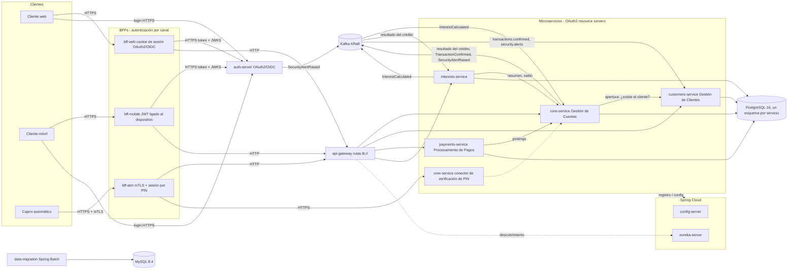
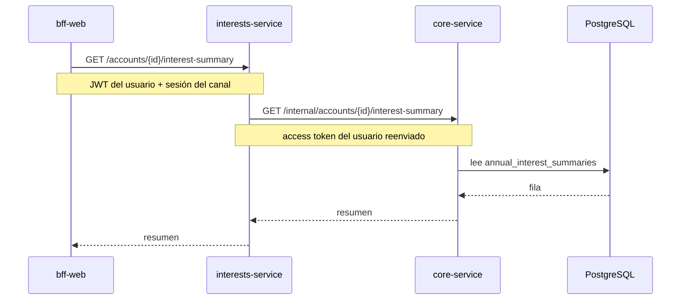
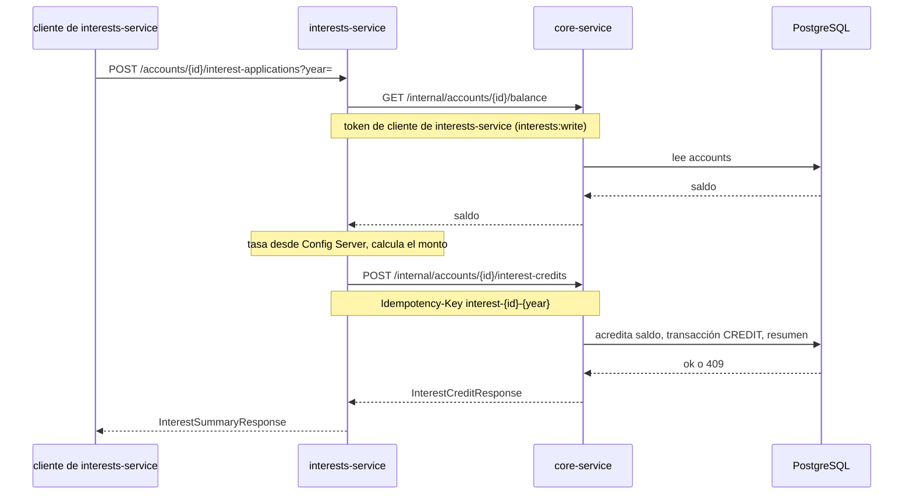
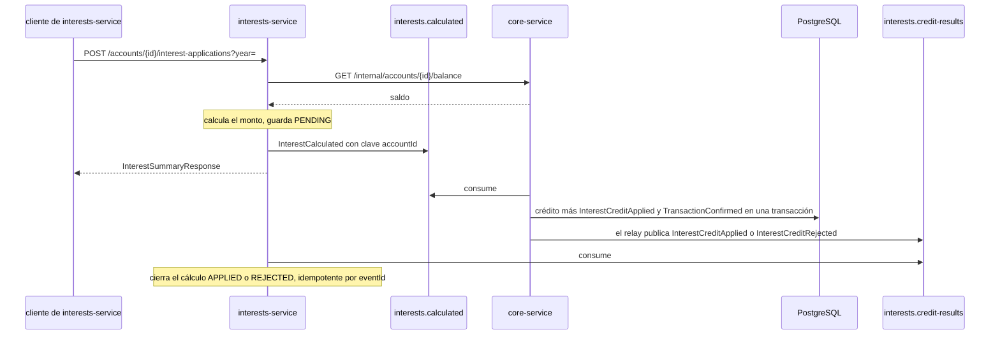
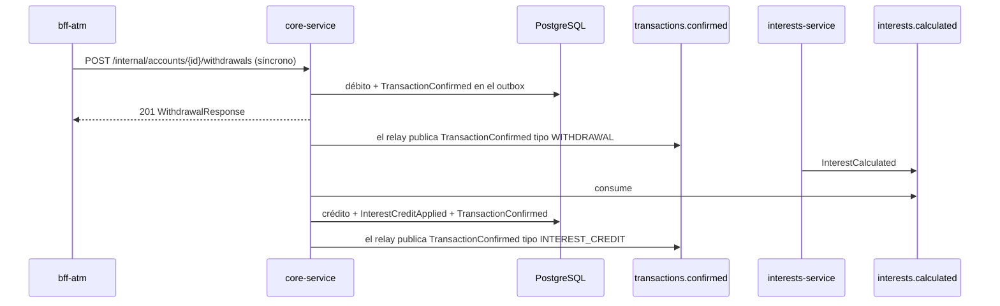

# Arquitectura

XYZ Bank expone tres backends por canal (BFFs) frente a una plataforma interna a la que se entra por `api-gateway`. La plataforma tiene tres microservicios de negocio — `core-service` (Gestión de Cuentas), `customers-service` (Gestión de Clientes) y `payments-service` (Procesamiento de Pagos) — más `interests-service` para los intereses anuales, `auth-server` (el único emisor de tokens OAuth 2.0 / OIDC), `config-server` y `eureka-server`. Los servicios comparten una PostgreSQL con un esquema por servicio. Un único broker Apache Kafka en modo KRaft transporta la saga de acreditación de intereses, las transacciones confirmadas y las alertas de seguridad. Los procesos batch legacy corren como jobs de Spring Batch (`data-migration`) que escriben sus reportes en una instancia MySQL aparte; esos reportes no se cargan en las tablas de la plataforma.

## Procesos críticos de la migración

El paso del sistema mainframe COBOL/Shell a microservicios descansa en cinco procesos. Cada uno elimina una limitación del legacy y corresponde a una parte de este repositorio.

| # | Proceso | Limitación del legacy que elimina | Dónde vive | Registros de decisión |
|---|---|---|---|---|
| 1 | Migración de los procesos batch a Spring Batch | Jobs Shell/COBOL sin reinicio, sin reintento parcial y sin paralelismo | `data-migration`: `dailyTransactionsJob`, `monthlyInterestsJob`, `annualGenerationJob` | [`data-migration/docs/jobs.md`](../data-migration/docs/jobs.md) |
| 2 | División del monolito en microservicios | Un único deployable en el que una falla de cualquier módulo tumba todo el sistema y escalar es todo o nada | `core-service`, `customers-service`, `payments-service`, `interests-service`, con Eureka, Config Server y `api-gateway` | [ADR 004](adr/004-service-decomposition.md) |
| 3 | Backend for Frontend por canal | Web, móvil y cajero reciben los mismos payloads de un solo backend, y los equipos de frontend quedan atados a su ciclo de releases | `bff-web`, `bff-mobile`, `bff-atm` | [ADR 001](adr/001-bff-strategy.md) |
| 4 | Seguridad distribuida con Spring Security / Spring Cloud | Seguridad centralizada y solo perimetral, que no se sostiene en un sistema distribuido | `auth-server` (Spring Authorization Server), resource servers en cada servicio, credenciales por canal en cada BFF, TLS y mTLS | [Servidor de autorización](#servidor-de-autorización) |
| 5 | Mensajería asíncrona con Apache Kafka | Acoplamiento síncrono: un crédito o una notificación falla cada vez que el otro lado está caído | Tópicos `interests.calculated`, `interests.credit-results`, `transactions.confirmed` y `security.alerts`, cada uno con su `.DLT` | [ADR 002](adr/002-event-architecture.md), [ADR 003](adr/003-kafka-default-and-dead-letter-topics.md) |

### Procesos batch en detalle

- **Jobs.** Cada job es un step de guarda (se salta si el ledger `migration_executions` ya registra SUCCESS), un step chunk particionado (leer el CSV, procesar, escribir) y un step de cierre: el job diario publica sus reportes y reconstruye `daily_transaction_summaries`, y el job anual consolida `annual_audit_reports` a partir de los movimientos en staging.
- **Errores.** Una política de skip descarta los registros inválidos (errores de dominio, líneas que no se pueden parsear) hasta `skip-limit`. Una política de reintento reintenta los errores transitorios de base de datos con backoff exponencial (1 s, ×2, hasta 10 s).
- **Reinicio.** `JobRestartLauncher` reinicia la última ejecución FAILED de una instancia del job desde su último chunk confirmado, hasta `max-restarts` veces; Compose reinicia el contenedor ante una falla hasta 3 veces.
- **Paralelismo y escala.** Cada job se particiona por rango de líneas del CSV sobre un pool de hilos acotado (`throttle-limit`), con tamaño de chunk configurable y upserts en lote.
- **Integridad.** Las escrituras son upserts idempotentes por clave de negocio, así que una corrida reiniciada o repetida converge a las mismas filas. Los tests comparan los resultados con archivos de referencia (golden files) capturados de la salida legacy, y prueban que una corrida interrumpida termina igual que una limpia.

## Requerimientos de negocio y decisiones de arquitectura

La arquitectura responde a tres requerimientos de negocio planteados por el banco. Cada decisión se justifica por el requerimiento al que sirve.

### 1. Escalar y evolucionar cada capacidad por separado

El mainframe solo podía crecer como un todo, y cualquier cambio obligaba a desplegar el sistema completo.

- **Decisión: microservicios por capacidad de negocio, con un esquema cada uno** ([ADR 004](adr/004-service-decomposition.md)). Cuentas, clientes y pagos se despliegan, escalan y versionan por separado. Cada servicio escribe solo en su propio esquema, así que un cambio en uno no puede romper los datos de otro.
- **Decisión: servicios sin estado detrás de Eureka y `api-gateway`.** Nada se guarda en la memoria del proceso, el outbox se reclama con `SELECT ... FOR UPDATE SKIP LOCKED` y los consumidores son idempotentes por `eventId`. Por eso `docker compose up --scale` (o la cantidad deseada de tareas de un servicio ECS, ver [`deploy/aws/README.md`](../deploy/aws/README.md)) agrega instancias según la demanda.
- **Decisión: configuración centralizada en `config-server`.** Un archivo por servicio en `config-repo/` cambia timeouts, tasas y flags sin reconstruir imágenes.

### 2. Mantener disponibles las operaciones críticas y los datos consistentes cuando una parte falla

Una falla en un módulo legacy detenía todas las operaciones, y un sistema bancario no puede perder ni duplicar dinero.

- **Decisión: Resilience4j en cada llamada remota.** Timeouts, circuit breakers, reintentos solo en operaciones idempotentes, y alternativas explícitas: un BFF responde 503 en vez de devolver saldos viejos, una cuenta no se abre si `customers-service` está caído, y un pago queda `PENDING` cuando `core-service` está caído y se completa al repetir la misma `Idempotency-Key`.
- **Decisión: escrituras idempotentes con bloqueo optimista.** Cada escritura recibe una `Idempotency-Key` y bloquea el agregado afectado, así que un reintento nunca mueve dinero dos veces.
- **Decisión: Kafka con outbox transaccional, reintentos acotados y dead-letter topics.** Un evento se escribe en la misma transacción de base de datos que el cambio que informa, y nunca se pierde ni se desordena dentro de una cuenta. Un registro que sigue fallando va a `<tópico>.DLT` en vez de bloquear su partición.
- **Decisión: jobs batch reiniciables e idempotentes.** Una migración interrumpida se reanuda y produce el mismo resultado que el proceso legacy.
- **Decisión: observabilidad.** Métricas de Prometheus, trazas distribuidas sobre HTTP y Kafka (Zipkin), y un patrón de log común con `traceId`, `spanId` y `correlationId` en todos los servicios, para encontrar y corregir fallas que cruzan servicios.

### 3. Atender cada canal de forma segura y eficiente

Web, móvil y cajero recibían los mismos datos, con una seguridad limitada al perímetro.

- **Decisión: un BFF por canal** ([ADR 001](adr/001-bff-strategy.md)). Web recibe payloads completos y agregados; móvil, payloads mínimos para ahorrar ancho de banda; el cajero, solo verificación de PIN, saldo y retiro.
- **Decisión: una credencial por canal y tokens en todas partes.** OIDC con PKCE y cookie de sesión HttpOnly para web, JWT ligado al dispositivo para móvil, y mTLS más PIN de tarjeta para el cajero. `auth-server` rechaza scopes de otro canal, y cada servicio es un resource server OAuth2 que verifica firma, emisor, audiencia y scope.
- **Decisión: TLS en todo borde de cara al cliente.** Los BFFs y `auth-server` solo sirven HTTPS, y el PIN viaja únicamente por el conector TLS de `core-service`.
- **Decisión: eventos de seguridad.** Una tarjeta bloqueada o un refresh token reutilizado publica en `security.alerts`, y el cliente lo ve en su feed de notificaciones.

## Topología

Cada canal prueba quién es el llamante con una credencial real en vez de una cabecera de confianza: cookie de sesión OAuth2/OIDC para web, JWT ligado al dispositivo para móvil, y mTLS más una sesión verificada por PIN para el cajero. Todo borde de cara al cliente es TLS; los bordes BFF→plataforma siguen en HTTP plano, salvo la única llamada que transporta un PIN, que es TLS-only por diseño.

Los tres BFFs llegan a la plataforma por `api-gateway` (Spring Cloud Gateway, una sola `PLATFORM_GATEWAY_URL`): `/<servicio>/**` se enruta con `lb://` a una instancia registrada en Eureka, y `Authorization`, `X-Correlation-Id` e `Idempotency-Key` se reenvían sin cambios. El gateway no valida tokens; eso lo hace cada servicio. La única excepción es la verificación de PIN de `bff-atm`, que va directa al conector TLS de `core-service`. Todos los servicios de plataforma, el gateway y los BFFs se registran en Eureka y cargan su configuración desde `config-server`. `bff-web` lee el perfil y el feed de notificaciones desde `customers-service`, las cuentas y movimientos desde `core-service`, y los resúmenes de intereses desde `interests-service` (feature flag encendida por defecto). `payments-service` recibe transferencias, depósitos y pagos de cuentas de clientes internos con `payments:write` (todavía ningún BFF los expone) y los aplica mediante `/internal/postings` de `core-service`. `interests-service` descubre `core-service` por nombre de servicio (LoadBalancer) y protege sus llamadas HTTP a core con un circuit breaker de Resilience4j. El GET del resumen anual de intereses sigue siendo síncrono y reenvía el bearer del usuario. Por defecto en Compose, el crédito de intereses viaja por la saga de Kafka (`FEATURE_INTEREST_CREDIT_VIA_KAFKA=true`): el cálculo se publica como `InterestCalculated`, `core-service` acredita la cuenta y luego publica el resultado. Con la flag en `false`, el crédito usa en cambio el camino HTTP síncrono, en el que `interests-service` se autentica ante `core-service` con su propio access token de client credentials (scope `interests:write`). Registro de decisión: [`docs/adr/002-event-architecture.md`](adr/002-event-architecture.md).

```mermaid
flowchart LR
  subgraph clients [Clientes]
    WebClient[Cliente web]
    MobileClient[Cliente móvil]
    AtmClient[Cajero automático]
  end

  subgraph bffs [BFFs - autenticación por canal]
    BffWeb[bff-web cookie de sesión OAuth2/OIDC]
    BffMobile[bff-mobile JWT ligado al dispositivo]
    BffAtm[bff-atm mTLS + sesión por PIN]
  end

  AuthServer[auth-server OAuth2/OIDC]
  Gateway[api-gateway rutas lb://]

  subgraph services [Microservicios - OAuth2 resource servers]
    CoreService[core-service Gestión de Cuentas]
    CoreServicePin[core-service conector de verificación de PIN]
    CustomersService[customers-service Gestión de Clientes]
    PaymentsService[payments-service Procesamiento de Pagos]
    InterestsService[interests-service]
  end

  subgraph infra [Spring Cloud]
    ConfigServer[config-server]
    EurekaServer[eureka-server]
  end

  Kafka[(Kafka KRaft)]
  Postgres[(PostgreSQL 16, un esquema por servicio)]
  MySQL[(MySQL 8.4)]
  Migration[data-migration Spring Batch]

  WebClient -- HTTPS --> BffWeb
  MobileClient -- HTTPS --> BffMobile
  AtmClient -- HTTPS + mTLS --> BffAtm
  WebClient -- "login HTTPS" --> AuthServer
  MobileClient -- "login HTTPS" --> AuthServer
  BffWeb -- "HTTPS token + JWKS" --> AuthServer
  BffMobile -- "HTTPS token + JWKS" --> AuthServer
  BffWeb -- HTTP --> Gateway
  BffMobile -- HTTP --> Gateway
  BffAtm -- HTTP --> Gateway
  BffAtm -- HTTPS --> CoreServicePin
  Gateway --> CoreService
  Gateway --> CustomersService
  Gateway --> PaymentsService
  Gateway --> InterestsService
  CoreService -- "apertura: ¿existe el cliente?" --> CustomersService
  PaymentsService -- "postings" --> CoreService
  InterestsService -- "resumen, saldo" --> CoreService
  InterestsService -- "InterestCalculated" --> Kafka
  Kafka -- "InterestCalculated" --> CoreService
  CoreService -- "resultado del crédito, TransactionConfirmed, SecurityAlertRaised" --> Kafka
  AuthServer -- "SecurityAlertRaised" --> Kafka
  Kafka -- "resultado del crédito" --> InterestsService
  Kafka -- "transactions.confirmed, security.alerts" --> CustomersService
  services -. "registro / config" .-> infra
  Gateway -. "descubrimiento" .-> EurekaServer
  CoreService --> Postgres
  CustomersService --> Postgres
  PaymentsService --> Postgres
  InterestsService --> Postgres
  CoreServicePin -.-> CoreService
  Migration --> MySQL
```

El conector de verificación de PIN de `core-service` (`CoreServicePin` arriba) es un segundo conector Tomcat del mismo servicio, no un deployable aparte: comparte el proceso y el acceso a base de datos de `core-service`. Se dibuja por separado solo para mostrar que ese conector termina TLS, mientras todos los demás endpoints de `core-service` siguen en HTTP plano.

## Servidor de autorización

`auth-server` (`platform/auth-server`, Spring Authorization Server, HTTPS en `:9000`) es el único emisor de la plataforma. Registra cuatro clientes confidenciales. `bff-web` y `bff-mobile` usan `authorization_code` con PKCE obligatorio más `refresh_token`. `bff-atm` e `interests-service` usan solo `client_credentials`. Cada cliente de canal puede pedir únicamente `openid`, `profile` y los scopes de su propio canal, tomados de `Channel` en `shared-security`; una solicitud con cualquier otro scope se rechaza completa (`invalid_scope`). Los access tokens de usuario llevan `sub` = el id del cliente del banco y `channel` = `WEB` o `MOBILE`, según el cliente al que se emite el token. Los tokens de servicio llevan `channel` = `ATM` o `INTERESTS` y no tienen un cliente del banco como sujeto. Los tokens se firman con RS256 usando una clave cargada desde un keystore PKCS12 provisto (`AUTH_SIGNING_KEYSTORE_*`); la clave pública se publica en `/oauth2/jwks` bajo su huella RFC 7638. El servidor no arranca sin ese keystore, así que un reinicio nunca invalida los tokens emitidos. Ningún servicio comparte un secreto de firma con otro.

**Estado.** Las autorizaciones (códigos y los tokens emitidos a partir de ellos), los consentimientos y los clientes registrados se guardan, mediante los servicios JDBC de Spring Authorization Server, en la PostgreSQL propia de `auth-server` (`auth-postgres`: contenedor, base `auth_server`, usuario y volumen propios, sin puerto publicado en el host). `auth-server` no tiene credenciales para `core_service`, ni los servicios de plataforma para `auth_server`; los datos bancarios quedan en los esquemas de los servicios de plataforma. Flyway es dueño del esquema (las tablas que trae Spring Authorization Server, con `blob` → `text` para PostgreSQL). Los cuatro clientes se insertan o actualizan en cada arranque, y cada secreto se guarda solo como hash bcrypt. La rotación de refresh tokens y la revocación de dispositivos móviles también viven aquí (`rotated_refresh_tokens`, registros de dispositivos), no en `core-service`. Nada relacionado con OAuth se guarda en la memoria del proceso, así que los reinicios son invisibles para los clientes que tienen códigos válidos.

**Un emisor, dos caminos de red.** El navegador llega a `auth-server` como `localhost:9000`; los contenedores de los BFFs llegan por la red de Docker como `auth-server:9000`. El emisor está fijado a la URL pública (`AUTH_PUBLIC_ISSUER` en `.env`, `https://localhost:9000` en `.env.example`; todos los verificadores y ambos BFFs leen ese mismo valor), así que los tokens y el documento de discovery lo llevan sin importar el nombre de host que usó la solicitud. Cada BFF se configura con los endpoints separados según quién los llama — la `authorization-uri` de cara al navegador en `localhost`, y la `token-uri` y `jwk-set-uri` de back-channel en `auth-server` — en vez de usar OIDC discovery (cuyos endpoints anunciados están todos en `localhost` y no se alcanzan desde un contenedor). Como ese modo de endpoints explícitos desactiva la verificación de emisor de Spring, cada BFF valida por su cuenta el `iss` del ID token contra `OIDC_ISSUER`. El certificado TLS nombra ambos hosts y encadena a la CA de desarrollo, en la que los contenedores de los BFFs confían mediante el trust store de su JVM. `auth-server` guarda su sesión de login en la cookie `XYZ_AUTH_SESSION`: las cookies se acotan por host, no por puerto, y un `JSESSIONID` en `localhost` sobrescribiría la sesión de los BFFs que guarda la solicitud de autorización pendiente.

Tras el login, el BFF conserva el access token de auth-server como sesión y lo reenvía sin cambios. `bff-web` lo guarda en la cookie `session`, y el refresh token en `refresh_token`. `bff-mobile` devuelve ambos en el cuerpo del login, con el `device_id` ligado dentro del access token. `core-service` e `interests-service` verifican esos tokens contra el JWKS (emisor `https://localhost:9000`, audiencia, expiración y `azp` que coincida con `channel`). No guardan ninguna clave de firma.

`bff-atm` no reenvía un token de usuario. Llama a `core-service` con su propio token de `client_credentials`. Una verificación de PIN exitosa devuelve `atmSessionId`; `bff-atm` mete ese id en una sesión HS256 ligada al terminal que solo `bff-atm` puede firmar (`BFF_ATM_SESSION_SECRET`) y devuelve el id como `X-Atm-Session`. `core-service` obtiene el cliente a partir de la fila de sesión que él mismo creó. Las suites de tests de los BFFs siguen usando su `MockOidcProvider` de WireMock y no dependen de un `auth-server` en ejecución.

Lo que se mantiene igual en todos los canales: un BFF por canal, los datos bancarios en manos de los servicios de plataforma (cada uno en su esquema, nunca en un BFF), MySQL reservado para los reportes de migración, y los contratos de payload existentes de los BFFs. Qué prueba la credencial de cada canal y cómo se valida está documentado en `docs/contracts/*/openapi.yaml`. Kafka coordina el crédito de intereses cuando la feature flag está encendida. No es dueño del estado de las cuentas.

## Tolerancia a fallos (BFFs)

Cada BFF acota todas sus llamadas salientes con un timeout de conexión y de lectura configurado en el cliente HTTP (lecturas a `core-service` 1 s / 2 s; las llamadas a core de bff-atm y todas las llamadas a `auth-server` o `interests-service` 1 s / 3 s). No se usa el `TimeLimiter` de Resilience4j: abandona una llamada bloqueante sin detenerla, lo que permitiría que un retiro reintentado se superponga con el original.

Hay un circuit breaker por dependencia en cada BFF: `coreService`, `authServer` y, en bff-web, `interestsService`. Un breaker cuenta solo fallas de conexión, timeouts, respuestas cortadas a mitad de lectura y 5xx; un 4xx nunca lo abre. Los breakers de core e intereses usan una ventana de 20 llamadas, un mínimo de 10 llamadas y una tasa de falla del 50 %; `authServer` usa una ventana de 10 llamadas y un mínimo de 5. Cada uno espera 15 s abierto antes de pasar a semiabierto. Un breaker abierto responde el ProblemDetail 503 de siempre. Nunca sirve datos en caché y nunca pone la health en DOWN.

Los reintentos aplican solo a operaciones idempotentes, solo después de un destino inalcanzable, un timeout, una respuesta cortada, 502, 503 o 504, y nunca después de un 4xx, un 500 o con el circuito abierto:

| Se reintenta (intentos, backoff) | Nunca se reintenta, y por qué |
|---|---|
| Lecturas `GET` a `core-service` / `interests-service` (3, ~200 ms y luego ~400 ms, con jitter) | Verificación de PIN: un intento extra puede contar como otro PIN incorrecto y bloquear la tarjeta |
| Retiro ATM, misma `Idempotency-Key` y mismo cuerpo (2, 300 ms) | Grant de refresh: un reenvío tras una rotación completada es una reutilización, y `auth-server` revoca el login |
| Token `client_credentials` de `bff-atm` e `interests-service` (3, ~300 ms y luego ~600 ms) | Canje del código de autorización (de un solo uso) y revocación de dispositivo |

Un retiro se debita como máximo una vez, sin importar cuántos intentos lleguen: `core-service` repite la respuesta de una `Idempotency-Key` conocida, y la clave es única en `transactions`, así que un intento que se superpone con un original todavía en curso recibe la respuesta repetida o un 409. Cuando `auth-server` no está disponible, todos los caminos de los BFFs responden 503 en vez de 401/422, y no emiten ni borran ninguna sesión. Eso cubre login, refresh, revocación de dispositivo, obtención de la clave de firma y token de servicio. Las caídas del token de bff-atm y de interests-service cuentan solo contra `authServer`, nunca contra el breaker de `core-service`.

Actuator (health, `circuitbreakers`, `circuitbreakerevents`) se sirve en el puerto de administración interno, en HTTP plano, de cada BFF (9081 / 9082 / 9083), publicado solo en loopback por `docker-compose.override.yml` (el `docker-compose.yaml` desplegable publica solo los BFFs y `auth-server`, en una red `public`, mientras todo lo demás queda en una red `internal` sin salida). El puerto de cara al cliente sigue respondiendo `/actuator/health` solo con el estado general. Los healthchecks de Compose usan los puertos de administración.

## Flujos de intereses

### Consulta — resumen anual de intereses

```mermaid
sequenceDiagram
  participant Web as bff-web
  participant Interests as interests-service
  participant Core as core-service
  participant Db as PostgreSQL

  Web->>Interests: GET /accounts/{id}/interest-summary
  Note over Web,Interests: JWT del usuario + sesión del canal
  Interests->>Core: GET /internal/accounts/{id}/interest-summary
  Note over Interests,Core: access token del usuario reenviado
  Core->>Db: lee annual_interest_summaries
  Db-->>Core: fila
  Core-->>Interests: resumen
  Interests-->>Web: resumen
```

### Comando — aplicar el interés anual (HTTP)

`FEATURE_INTEREST_CREDIT_VIA_KAFKA=false`. Es el camino alternativo: Compose arranca con la saga, y un servicio que corre fuera de Compose también usa este camino por defecto. Los tests del camino HTTP lo ejercitan.

```mermaid
sequenceDiagram
  participant Caller as cliente de interests-service
  participant Interests as interests-service
  participant Core as core-service
  participant Db as PostgreSQL

  Caller->>Interests: POST /accounts/{id}/interest-applications?year=
  Interests->>Core: GET /internal/accounts/{id}/balance
  Note over Interests,Core: token de cliente de interests-service (interests:write)
  Core->>Db: lee accounts
  Db-->>Core: saldo
  Core-->>Interests: saldo
  Note over Interests: tasa desde Config Server, calcula el monto
  Interests->>Core: POST /internal/accounts/{id}/interest-credits
  Note over Interests,Core: Idempotency-Key interest-{id}-{year}
  Core->>Db: acredita saldo, transacción CREDIT, resumen
  Db-->>Core: ok o 409
  Core-->>Interests: InterestCreditResponse
  Interests-->>Caller: InterestSummaryResponse
```

El bloqueo optimista sobre `accounts.version` y la restricción única `(account_id, year)` en los resúmenes evitan la doble aplicación; repetir la misma `Idempotency-Key` repite el crédito original. Las llamadas salientes de `interests-service` a `core-service` usan circuit breaker y reintento de Resilience4j, así que las fallas repetidas de core abren el breaker y fallan rápido. Con la flag de Kafka encendida no se llama a `creditInterest`, así que ese breaker ya no cubre el crédito. `fetchInterestSummary` y `fetchAccountBalance` siguen bajo él.

### Comando — aplicar el interés anual (saga de Kafka, por defecto en Compose)

`FEATURE_INTEREST_CREDIT_VIA_KAFKA=true`, el valor por defecto de `docker compose up`. Por eso un `200` del POST significa que el cálculo se publicó, no que la cuenta ya esté acreditada. El POST devuelve el resumen calculado en cuanto `InterestCalculated` se publica. El cálculo queda `PENDING` en el esquema `interests` hasta que `interests.credit-results` lo cierra. El endpoint HTTP de crédito sigue disponible para el camino con la flag apagada.

```mermaid
sequenceDiagram
  participant Caller as cliente de interests-service
  participant Interests as interests-service
  participant Calculated as interests.calculated
  participant Core as core-service
  participant Db as PostgreSQL
  participant Results as interests.credit-results

  Caller->>Interests: POST /accounts/{id}/interest-applications?year=
  Interests->>Core: GET /internal/accounts/{id}/balance
  Core-->>Interests: saldo
  Note over Interests: calcula el monto, guarda PENDING
  Interests->>Calculated: InterestCalculated con clave accountId
  Interests-->>Caller: InterestSummaryResponse
  Core->>Calculated: consume
  Core->>Db: crédito más InterestCreditApplied y TransactionConfirmed en una transacción
  Core->>Results: el relay publica InterestCreditApplied o InterestCreditRejected
  Interests->>Results: consume
  Note over Interests: cierra el cálculo APPLIED o REJECTED, idempotente por eventId
```

La clave de partición es `accountId`, y cada tópico tiene 3 particiones con un hilo consumidor por partición (ver [Mensajes fallidos y orden](#mensajes-fallidos-y-orden)). La entrega es at-least-once. Un `InterestCalculated` cuyo id de evento ya se procesó se confirma sin un segundo resultado, aunque su monto se haya recalculado desde un saldo mayor. El `eventId` es `interest:{accountId}:{year}`. La clave de idempotencia HTTP del camino síncrono sigue siendo `interest-{accountId}-{year}`. Un `eventId` duplicado no acredita el saldo dos veces. Una transacción de crédito fallida no deja fila en el outbox. Un rechazo de negocio (`VALIDATION`, `NOT_FOUND` o `CONFLICT`) publica `InterestCreditRejected` con `reason`, no cambia el saldo y confirma el offset del consumidor para no bloquear la partición. Con la flag de Kafka apagada, un crédito HTTP no escribe filas de resultado de intereses en el outbox. `core-service` es el único servicio con outbox, porque es el único con una transacción local de base de datos alrededor del crédito. Ver [`docs/adr/002-event-architecture.md`](adr/002-event-architecture.md).

### Mensajes fallidos y orden

**Particiones y concurrencia.** `interests.calculated`, `interests.credit-results`, `transactions.confirmed` y `security.alerts` tienen 3 particiones (`kafka-init` los crea, y sube a 3 los tópicos existentes que tengan menos). Todos los productores usan `accountId` como clave, así que los registros de una cuenta quedan en una partición y en orden, mientras cuentas distintas se procesan en paralelo en los 3 hilos de listener que arranca cada servicio. Subir la cantidad de particiones de un tópico que todavía tiene registros sin consumir reasigna las claves; antes hay que vaciarlo.

**Reintentos y luego un dead-letter topic.** Cuando un consumidor (`core-service` en `interests.calculated`, `interests-service` en `interests.credit-results`) no logra procesar un registro, lo reintenta 3 veces con esperas de 1 s, 2 s y 4 s, y luego lo publica en `<tópico>.DLT` con su clave, su payload y la falla en las cabeceras, confirma el offset y sigue. Así, un registro irrecuperable libera su partición en unos 7 s, y los registros que vienen detrás se procesan con normalidad. Los reintentos bloquean la partición en vez de pasar por tópicos de reintento, porque esos tópicos dejarían que registros posteriores de la misma cuenta adelanten al que está fallando. Reenviar es seguro: el crédito es idempotente por id de evento. Un rechazo de negocio (cuenta desconocida, año ya acreditado) no es una falla: se informa como `InterestCreditRejected`. Si falla la propia publicación en el DLT, el registro se vuelve a entregar en vez de descartarse. Nada reprocesa un DLT automáticamente; un operador lo inspecciona con las herramientas de Kafka, y un `InterestCalculated` que cae en el DLT deja su cálculo `PENDING` y la cuenta sin acreditar. `customers-service` consume `transactions.confirmed` y `security.alerts` con la misma política (3 reintentos y luego `.DLT`) para armar el feed de notificaciones de cada cliente, idempotente por `eventId`.

**Orden desde el outbox.** El relay publica las filas del outbox en el orden en que se escribieron (`outbox_events.seq`, Flyway `V13`), no por fecha e id, así que los eventos de una cuenta llegan a `interests.credit-results` y a `transactions.confirmed` en el orden en que se confirmaron. Si un envío falla, los eventos posteriores de esa cuenta esperan a la siguiente corrida para no adelantarlo, y las demás cuentas siguen fluyendo.

### Evento — TransactionConfirmed (cada movimiento de dinero confirmado)

Cuando `FEATURE_TRANSACTION_CONFIRMED_EVENTS` está encendida, cada retiro confirmado y cada crédito de interés confirmado escriben una fila `TransactionConfirmed` en el mismo outbox transaccional que usa la saga de intereses. El relay del outbox la publica en `transactions.confirmed` con clave de partición `accountId`. El contrato HTTP del retiro ATM no cambia: el evento es un efecto secundario de `persistWithdrawal`. Un reintento idempotente de retiro no inserta un segundo evento. Un retiro rechazado o un crédito de interés rechazado no inserta `TransactionConfirmed`.

```mermaid
sequenceDiagram
  participant Atm as bff-atm
  participant Core as core-service
  participant Db as PostgreSQL
  participant Confirmed as transactions.confirmed
  participant Interests as interests-service
  participant Calculated as interests.calculated

  Atm->>Core: POST /internal/accounts/{id}/withdrawals (síncrono)
  Core->>Db: débito + TransactionConfirmed en el outbox
  Core-->>Atm: 201 WithdrawalResponse
  Core->>Confirmed: el relay publica TransactionConfirmed tipo WITHDRAWAL

  Interests->>Calculated: InterestCalculated
  Core->>Calculated: consume
  Core->>Db: crédito + InterestCreditApplied + TransactionConfirmed
  Core->>Confirmed: el relay publica TransactionConfirmed tipo INTEREST_CREDIT
```

Payload de `TransactionConfirmed`: `eventId` (id de la transacción), `eventType`, `schemaVersion`, `accountId`, `type` (`WITHDRAWAL` | `INTEREST_CREDIT` | `PAYMENT_DEBIT` | `PAYMENT_CREDIT`), `amount`, `currency` y `occurredAt`. No incluye número de tarjeta, PIN, datos personales del cliente ni id del terminal ATM.
