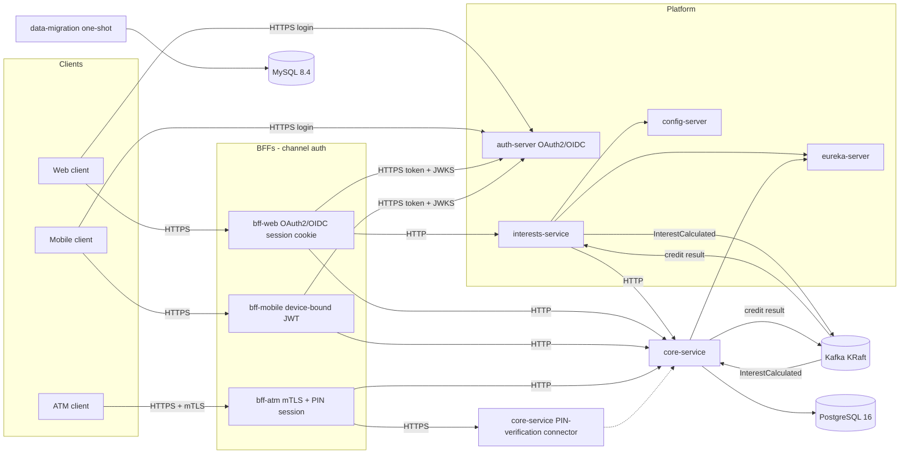
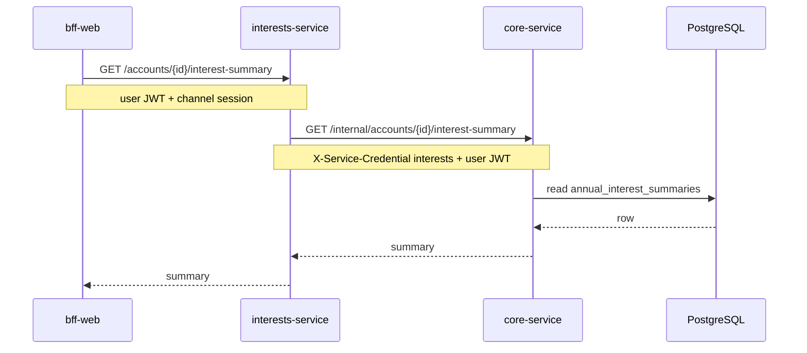
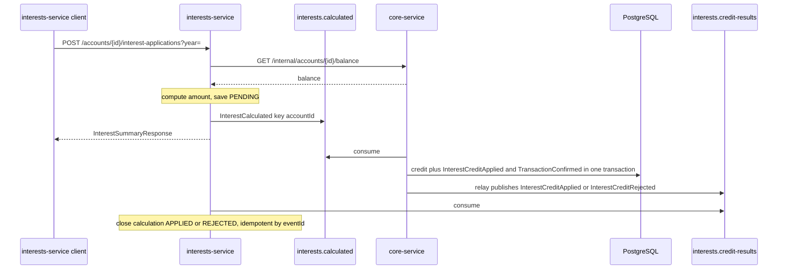
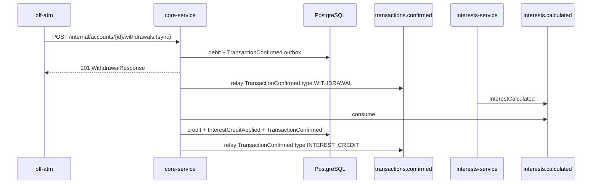

# Architecture

XYZ Bank exposes three channel-specific backends for frontend (BFFs) in front of an internal platform: `core-service` (sole PostgreSQL owner), plus `config-server`, `eureka-server`, `interests-service` for annual interest calculation and cutover, and `auth-server`, the OAuth 2.0 / OIDC provider for the web and mobile logins. A single Apache Kafka broker in KRaft mode carries the interest-credit saga. The legacy CSV sanitization job writes reports to a separate MySQL instance; those reports are not loaded into core-service tables.

## Topology

Each channel proves who the caller is with a real credential instead of a trusted header: OAuth2/OIDC session cookie for web, a device-bound JWT for mobile, and mTLS plus a PIN-verified session for ATM. Every client-facing edge is TLS; BFF→platform edges stay plain HTTP except the one call that carries a raw PIN, which is TLS-only by design.

`bff-web` routes interest-summary traffic to `interests-service` (feature flag on by default). Mobile and ATM keep talking to `core-service` directly. `interests-service` loads config from `config-server`, registers with Eureka, discovers `core-service` by service id (LoadBalancer), and wraps outbound HTTP calls to core with a Resilience4j circuit breaker. The annual interest summary GET stays synchronous and forwards the user bearer. Interest credit stays on that HTTP path while `FEATURE_INTEREST_CREDIT_VIA_KAFKA` is `false` (the default): `interests-service` authenticates with its service credential and JWT scope `interests:write`. With the flag `true`, the same calculation is published as `InterestCalculated` and `core-service` credits the account, then publishes the result. Decision record: [`docs/adr/002-event-architecture.md`](adr/002-event-architecture.md).

```mermaid
flowchart LR
  subgraph clients [Clients]
    WebClient[Web client]
    MobileClient[Mobile client]
    AtmClient[ATM client]
  end

  subgraph bffs [BFFs - channel auth]
    BffWeb[bff-web OAuth2/OIDC session cookie]
    BffMobile[bff-mobile device-bound JWT]
    BffAtm[bff-atm mTLS + PIN session]
  end

  subgraph platform [Platform]
    AuthServer[auth-server OAuth2/OIDC]
    ConfigServer[config-server]
    EurekaServer[eureka-server]
    InterestsService[interests-service]
  end

  CoreService[core-service]
  CoreServicePin[core-service PIN-verification connector]
  Kafka[(Kafka KRaft)]
  Postgres[(PostgreSQL 16)]
  MySQL[(MySQL 8.4)]
  Migration[data-migration one-shot]

  WebClient -- HTTPS --> BffWeb
  MobileClient -- HTTPS --> BffMobile
  WebClient -- "HTTPS login" --> AuthServer
  MobileClient -- "HTTPS login" --> AuthServer
  BffWeb -- "HTTPS token + JWKS" --> AuthServer
  BffMobile -- "HTTPS token + JWKS" --> AuthServer
  AtmClient -- HTTPS + mTLS --> BffAtm
  BffWeb -- HTTP --> InterestsService
  BffWeb -- HTTP --> CoreService
  BffMobile -- HTTP --> CoreService
  BffAtm -- HTTP --> CoreService
  BffAtm -- HTTPS --> CoreServicePin
  InterestsService --> ConfigServer
  InterestsService --> EurekaServer
  CoreService --> EurekaServer
  InterestsService -- HTTP --> CoreService
  InterestsService -- "InterestCalculated" --> Kafka
  Kafka -- "InterestCalculated" --> CoreService
  CoreService -- "credit result" --> Kafka
  Kafka -- "credit result" --> InterestsService
  CoreService --> Postgres
  CoreServicePin -.-> CoreService
  Migration --> MySQL
```

`core-service`'s PIN-verification connector (`CoreServicePin` above) is a second Tomcat connector on the same service, not a separate deployable — it shares `core-service`'s process and database access, drawn separately here only to show it terminates TLS while every other `core-service` endpoint stays plain HTTP.

## Authorization server

`auth-server` (`platform/auth-server`, Spring Authorization Server, HTTPS on `:9000`) is where web and mobile customers log in. It registers exactly two clients, both restricted to `authorization_code` with mandatory PKCE: `bff-web` (confidential, `client_secret_basic`) and `bff-mobile` (public). Each client may request only `openid`, `profile` and its own channel's scope set, taken from `shared-security`'s `Channel` — a request with any other scope is rejected as a whole (`invalid_scope`). Every ID and access token carries `sub` = the customer id and `channel` = `WEB` or `MOBILE`, decided by the client the token is issued to. Tokens are RS256-signed with a key loaded from a provisioned PKCS12 keystore (`AUTH_SIGNING_KEYSTORE_*`); the public key is published at `/oauth2/jwks` under its RFC 7638 thumbprint. The server refuses to start without that keystore, so a restart never invalidates issued tokens.

**State.** Authorizations (codes and the tokens issued from them), consents and registered clients are stored through Spring Authorization Server's JDBC services in `auth-server`'s own PostgreSQL (`auth-postgres`: own container, database `auth_server`, user and volume, not published on the host). `auth-server` has no credentials for `core_service` and `core-service` none for `auth_server`; `core-service` remains the only component with access to banking data. Flyway owns the schema (Spring Authorization Server's bundled tables, `blob` → `text` for PostgreSQL). The two channel clients are still derived from `Channel` and are upserted into the store on every startup, the `bff-web` secret stored only as a bcrypt hash. Nothing OAuth-related is kept in process memory, so restarts are invisible to clients holding valid codes.

**One issuer, two network paths.** The browser reaches `auth-server` as `localhost:9000`; the BFF containers reach it on the Docker network as `auth-server:9000`. The issuer is pinned to the public URL (`https://localhost:9000`), so tokens and the discovery document carry it whichever host name a request used. Each BFF is configured with the endpoints split by who calls them — the browser-facing `authorization-uri` on `localhost`, the back-channel `token-uri` and `jwk-set-uri` on `auth-server` — instead of OIDC discovery (whose advertised endpoints are all on `localhost` and unreachable from a container). Because that explicit-endpoint mode disables Spring's own issuer check, each BFF validates the ID token's `iss` against `OIDC_ISSUER` itself. The TLS certificate names both hosts and chains to the dev CA, which the BFF containers trust through their JVM trust store. `auth-server` keeps its login session in the `XYZ_AUTH_SESSION` cookie: cookies are scoped by host, not port, and a `JSESSIONID` on `localhost` would overwrite the BFFs' session holding the pending authorization request.

After login nothing changes downstream: each BFF reads only the ID token's `sub`, then mints its own short-lived session JWT (and obtains the refresh token from `core-service`) exactly as before. `core-service` still receives BFF-minted session JWTs; validating `auth-server` access tokens in `core-service`, and service-to-service authentication, come in a later change. The BFF test suites keep using their WireMock `MockOidcProvider` and do not depend on `auth-server`.

What stays constant regardless of channel: one BFF per channel, `core-service` as the only database owner for banking entities, MySQL reserved for migration reports, and the existing BFF payload contracts. What each channel's credential proves and how it's validated is documented in `docs/contracts/*/openapi.yaml`. Kafka coordinates the interest credit when the feature flag is on. It does not own account state.

## Interest flows

### Query — annual interest summary

```mermaid
sequenceDiagram
  participant Web as bff-web
  participant Interests as interests-service
  participant Core as core-service
  participant Db as PostgreSQL

  Web->>Interests: GET /accounts/{id}/interest-summary
  Note over Web,Interests: user JWT + channel session
  Interests->>Core: GET /internal/accounts/{id}/interest-summary
  Note over Interests,Core: X-Service-Credential interests + user JWT
  Core->>Db: read annual_interest_summaries
  Db-->>Core: row
  Core-->>Interests: summary
  Interests-->>Web: summary
```

### Command — apply annual interest (HTTP, default)

`FEATURE_INTEREST_CREDIT_VIA_KAFKA=false`. This is the path Compose starts with, and the path the current end-to-end tests exercise.

```mermaid
sequenceDiagram
  participant Caller as interests-service client
  participant Interests as interests-service
  participant Core as core-service
  participant Db as PostgreSQL

  Caller->>Interests: POST /accounts/{id}/interest-applications?year=
  Interests->>Core: GET /internal/accounts/{id}/balance
  Note over Interests,Core: interests credential + JWT interests:write
  Core->>Db: read accounts
  Db-->>Core: balance
  Core-->>Interests: balance
  Note over Interests: rate from Config Server, compute amount
  Interests->>Core: POST /internal/accounts/{id}/interest-credits
  Note over Interests,Core: Idempotency-Key interest-{id}-{year}
  Core->>Db: credit balance, CREDIT txn, summary
  Db-->>Core: ok or 409
  Core-->>Interests: InterestCreditResponse
  Interests-->>Caller: InterestSummaryResponse
```

Optimistic locking on `accounts.version` and the unique `(account_id, year)` on summaries prevent double application; repeating the same `Idempotency-Key` replays the original credit. Outbound calls from `interests-service` to `core-service` use Resilience4j circuit breaker/retry so repeated core failures open the breaker and fail fast. With the Kafka flag on, `creditInterest` is not called, so that breaker no longer covers the credit. `fetchInterestSummary` and `fetchAccountBalance` stay on it.

### Command — apply annual interest (Kafka saga)

`FEATURE_INTEREST_CREDIT_VIA_KAFKA=true`. The POST returns the calculated summary as soon as `InterestCalculated` is published. The calculation stays `PENDING` in the in-memory repository until `interests.credit-results` closes it. The HTTP credit endpoint remains available for the flag-off path.

```mermaid
sequenceDiagram
  participant Caller as interests-service client
  participant Interests as interests-service
  participant Calculated as interests.calculated
  participant Core as core-service
  participant Db as PostgreSQL
  participant Results as interests.credit-results

  Caller->>Interests: POST /accounts/{id}/interest-applications?year=
  Interests->>Core: GET /internal/accounts/{id}/balance
  Core-->>Interests: balance
  Note over Interests: compute amount, save PENDING
  Interests->>Calculated: InterestCalculated key accountId
  Interests-->>Caller: InterestSummaryResponse
  Core->>Calculated: consume
  Core->>Db: credit plus InterestCreditApplied and TransactionConfirmed in one transaction
  Core->>Results: relay publishes InterestCreditApplied or InterestCreditRejected
  Interests->>Results: consume
  Note over Interests: close calculation APPLIED or REJECTED, idempotent by eventId
```

The partition key is `accountId`. Delivery is at-least-once. `eventId` is `interest:{accountId}:{year}`. The HTTP idempotency key on the synchronous path stays `interest-{accountId}-{year}`. A duplicate `eventId` does not credit the balance twice. A failed credit transaction leaves no outbox row. A business rejection (`VALIDATION`, `NOT_FOUND`, or `CONFLICT`) publishes `InterestCreditRejected` with `reason`, does not change the balance, and commits the consumer offset so the single partition is not blocked. With the Kafka flag off, an HTTP credit does not write interest-result outbox rows. `core-service` is the only service with an outbox, because it is the only service with a local database transaction around the credit. See [`docs/adr/002-event-architecture.md`](adr/002-event-architecture.md).

### Event — TransactionConfirmed (every confirmed money movement)

When `FEATURE_TRANSACTION_CONFIRMED_EVENTS` is on, every confirmed withdrawal and every confirmed interest credit writes a `TransactionConfirmed` row into the same transactional outbox used by the interest saga. The outbox relay publishes it to `transactions.confirmed` with partition key `accountId`. The ATM withdrawal HTTP contract is unchanged: the event is a side effect of `persistWithdrawal`. An idempotent withdrawal retry does not insert a second event. A rejected withdrawal or a rejected interest credit does not insert `TransactionConfirmed`.

```mermaid
sequenceDiagram
  participant Atm as bff-atm
  participant Core as core-service
  participant Db as PostgreSQL
  participant Confirmed as transactions.confirmed
  participant Interests as interests-service
  participant Calculated as interests.calculated

  Atm->>Core: POST /internal/accounts/{id}/withdrawals (sync)
  Core->>Db: debit + TransactionConfirmed outbox
  Core-->>Atm: 201 WithdrawalResponse
  Core->>Confirmed: relay TransactionConfirmed type WITHDRAWAL

  Interests->>Calculated: InterestCalculated
  Core->>Calculated: consume
  Core->>Db: credit + InterestCreditApplied + TransactionConfirmed
  Core->>Confirmed: relay TransactionConfirmed type INTEREST_CREDIT
```

`TransactionConfirmed` payload: `eventId` (transaction id), `eventType`, `schemaVersion`, `accountId`, `type` (`WITHDRAWAL` | `INTEREST_CREDIT`), `amount`, `currency`, `occurredAt`. No card number, PIN, personal customer data, or ATM terminal id.
